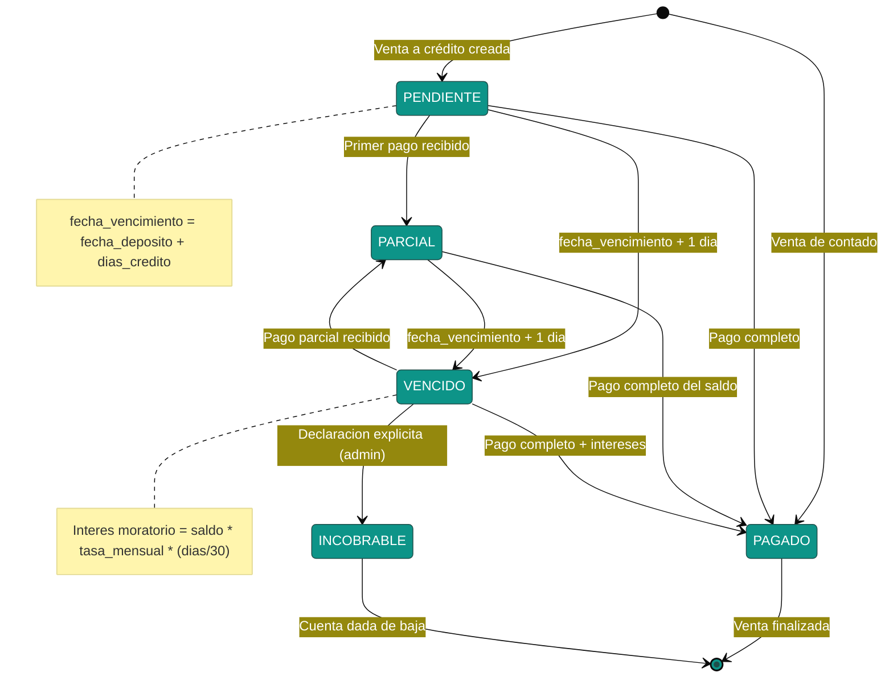
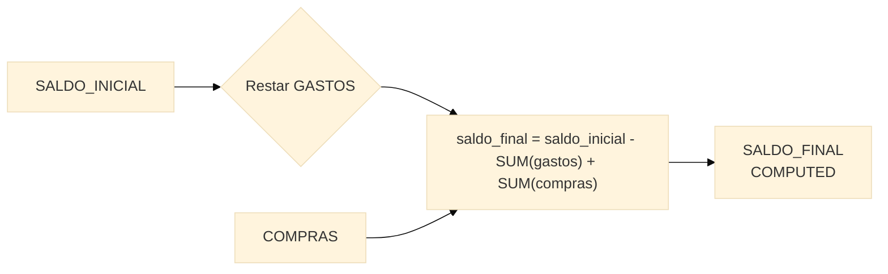
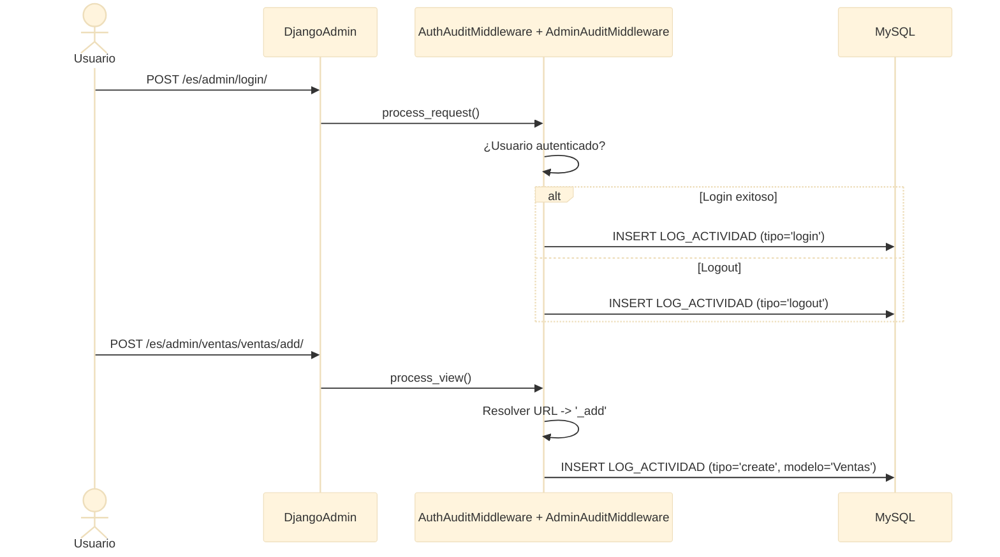
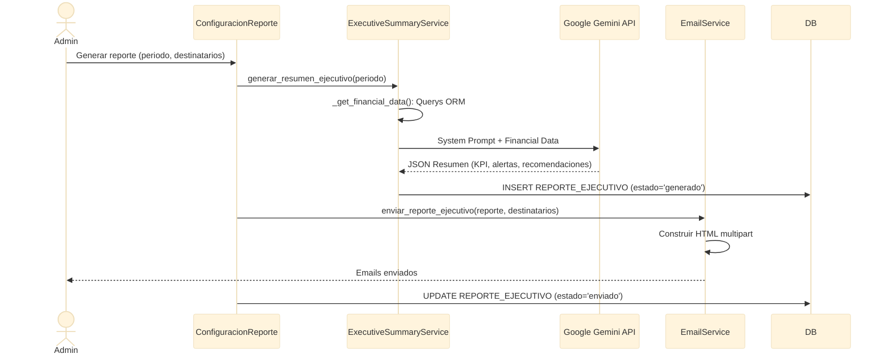

# Diagramas ERD — Agrícola de la Costa ERP

> Documento generado con la skill `mermaid-diagrams`.  
> Mejores prácticas aplicadas: entidades en **MAYÚSCULAS**, nombres singulares, restricciones documentadas (PK/FK/UK/NN), cardinalidad precisa, timestamps de auditoría.

---

## 1. ERD Maestro — Sistema Completo

Diagrama de alto nivel con todas las apps y sus relaciones principales. Sin atributos para mantener claridad visual.

```mermaid
%%{init: {'theme': 'base', 'themeVariables': {'primaryColor': '#0f1f35', 'primaryTextColor': '#fff', 'lineColor': '#0d9488'}}}%%
erDiagram
    %% ── Catálogo (Master Data) ──
    PAIS ||--o{ ESTADO : "tiene"
    PAIS ||--o{ CLIENTE : "nacionalidad"
    PAIS ||--o{ MERCADO_DESTINO : "agrupa"
    PAIS ||--o{ PRODUCTOR : "nacionalidad"
    ESTADO ||--o{ SUCURSAL : "contiene"
    SUCURSAL ||--o{ PRODUCTOR : "registra"

    %% ── Ventas ──
    CLIENTE ||--o{ VENTAS : "realiza"
    CLIENTE ||--o{ ANTICIPO : "genera"
    CLIENTE ||--o{ SALDO_CLIENTE : "adeuda"
    CLIENTE ||--o{ ESTADO_CUENTA_CLIENTE : "reporta"
    MERCADO_DESTINO ||--o{ CLIENTE : "clasifica"
    MERCADO_DESTINO ||--o{ VENTAS : "destina"
    TERMINO_CREDITO ||--o{ CLIENTE : "predeterminado"
    TERMINO_CREDITO ||--o{ VENTAS : "condiciona"
    AGENTE ||--o{ VENTAS : "gestiona"
    PRODUCTO ||--o{ VENTAS : "comercializa"
    SUCURSAL ||--o{ VENTAS : "opera"
    VENTAS ||--o{ PAGO_VENTA : "recibe"
    VENTAS ||--o| ANTICIPO : "aplica"
    VENTAS ||--|| SALDO_CLIENTE : "origina"
    CLIENTE ||--o{ ANTIGUEDAD_SALDO : "analiza"

    %% ── Gastos ──
    BANCO ||--o{ CUENTA : "tiene"
    SUCURSAL ||--o{ CUENTA : "opera"
    CUENTA ||--o{ GASTOS : "debita"
    CUENTA ||--o{ COMPRA : "debita"
    CUENTA ||--o{ SALDO_MENSUAL : "registra"
    CUENTA ||--o{ PAGO_VENTA : "recibe"
    CUENTA ||--o{ ANTICIPO : "recibe"
    CUENTA ||--o{ VENTAS : "deposita"
    CAT_GASTOS ||--o{ GASTOS : "categoriza"
    PRODUCTOR ||--o{ COMPRA : "vende"
    PRODUCTO ||--o{ COMPRA : "comprado"

    %% ── Capital e Inversiones ──
    CAT_INVERSION ||--o{ INVERSION : "categoriza"
    SUCURSAL ||--o{ INVERSION : "ejecuta"
    CUENTA ||--o{ INVERSION : "financia"
    INVERSION ||--o{ RENDIMIENTO_INVERSION : "genera"

    %% ── Auditoría ──
    USER ||--|| USER_PROFILE : "extiende"
    USER ||--o{ LOG_ACTIVIDAD : "genera"
    SITE_CONFIGURATION ||--o{ USER : "configura"

    %% ── Reportes IA ──
    CONFIGURACION_REPORTE }o--o{ DESTINATARIO_REPORTE : "envia_a"
    USER ||--o{ REPORTE_EJECUTIVO : "genera"
    CONFIGURACION_REPORTE ||--o{ REPORTE_EJECUTIVO : "configura"

    %% ── Obligaciones Fiscales ──
    SUCURSAL ||--o{ OBLIGACION_FISCAL : "registra"
```



---

## 2. Ventas + Cuentas por Cobrar — ERD Detallado

El dominio más complejo del sistema: 14 entidades con flujo completo desde cliente → venta → cobranza.

```mermaid
%%{init: {'theme': 'base', 'themeVariables': {'primaryColor': '#0d9488', 'primaryTextColor': '#fff', 'lineColor': '#0f1f35'}}}%%
erDiagram
    CLIENTE ||--o{ VENTAS : "realiza"
    CLIENTE ||--o{ ANTICIPO : "genera"
    CLIENTE ||--o{ SALDO_CLIENTE : "adeuda"
    CLIENTE ||--o{ ANTIGUEDAD_SALDO : "analiza"
    CLIENTE ||--o{ ESTADO_CUENTA_CLIENTE : "reporta"
    TERMINO_CREDITO ||--o{ CLIENTE : "predeterminado"
    TERMINO_CREDITO ||--o{ VENTAS : "condiciona"
    MERCADO_DESTINO ||--o{ CLIENTE : "clasifica"
    MERCADO_DESTINO ||--o{ VENTAS : "destina"
    AGENTE ||--o{ VENTAS : "gestiona"
    VENTAS ||--o| ANTICIPO : "aplica_anticipo"
    VENTAS ||--o{ PAGO_VENTA : "recibe"
    VENTAS ||--|| SALDO_CLIENTE : "origina"
    VENTAS |o--|| CONFIGURACION_CXC : "configurada_por"

    CLIENTE {
        bigint id PK "AUTO_INCREMENT"
        varchar nombre NN
        varchar telefono
        varchar correo
        varchar direccion
        varchar tipo_cliente "Contado|Credito|Mixto"
        decimal limite_credito
        varchar calificacion_credito "A+|A|B|C"
        bigint pais_id FK
        bigint mercado_destino_id FK "NULLABLE"
        bigint termino_credito_predeterminado_id FK "NULLABLE"
        boolean activo "DEFAULT TRUE"
        datetime fecha_registro
        varchar imagen
    }

    MERCADO_DESTINO {
        bigint id PK
        varchar nombre NN
        string moneda_preferida "DEFAULT USD"
        decimal factor_riesgo "1.0 = normal"
        boolean requiere_documentacion_especial
        boolean activo "DEFAULT TRUE"
    }

    TERMINO_CREDITO {
        bigint id PK
        varchar nombre NN "Ej: Net 30"
        int dias_credito "CHECK 1-365"
        decimal tasa_interes_mensual "0.0200 = 2%"
        boolean activo "DEFAULT TRUE"
    }

    AGENTE {
        bigint id PK
        varchar nombre NN
        varchar telefono
        varchar correo
        bigint pais_id FK
        date fecha_registro
    }

    ANTICIPO {
        bigint id PK
        bigint cliente_id FK NN
        bigint cuenta_id FK NN
        decimal monto "CHECK > 0"
        decimal monto_aplicado "CHECK >= 0"
        date fecha NN
        varchar estado_anticipo "Pendiente|Aplicado|Cancelado"
        varchar folio_factura_anticipo
        varchar descripcion
    }

    VENTAS {
        bigint id PK
        bigint cliente_id FK NN
        bigint producto_id FK NN
        bigint sucursal_id FK NN
        bigint agente_id FK NN
        bigint cuenta_id FK "NULLABLE"
        bigint termino_credito_id FK "NULLABLE"
        bigint mercado_destino_id FK "NULLABLE"
        bigint anticipo_id FK "NULLABLE UK"
        date fecha_salida_manifiesto NN
        date fecha_deposito NN
        varchar pedimento
        varchar carga UK
        varchar po
        varchar pedimento
        varchar carga
        varchar po
        decimal cantidad "CHECK > 0"
        decimal monto NN "CHECK > 0"
        varchar descripcion
        varchar tipo_venta "Nacional|Exportacion"
        varchar tipo_registro "VENTA|MAQUILA"
        varchar modalidad_pago "Contado|Credito"
        varchar estado_cobranza "Pagado|Pendiente|Parcial|Vencido|Incobrable"
        decimal monto_pagado
        date fecha_vencimiento
        varchar incoterm "FOB|CIF|etc"
        varchar moneda_venta "DEFAULT MXN"
        decimal tipo_cambio "DEFAULT 1.0000"
        date fecha_emision_cfdi
        varchar folio_factura
        varchar cfdi_cancelado
        varchar nota_credito
        varchar nota_cargo
        varchar numero_carga_comprador
        decimal ajuste "DEFAULT 0"
        datetime fecha_registro
    }

    PAGO_VENTA {
        bigint id PK
        bigint venta_id FK NN
        bigint cuenta_destino_id FK NN
        date fecha_pago NN
        decimal monto_pago "CHECK > 0"
        varchar metodo_pago "Efectivo|Transferencia|Cheque|Tarjeta"
        varchar referencia
        varchar notas
        varchar comprobante_pago "ruta archivo"
        datetime fecha_registro
    }

    SALDO_CLIENTE {
        bigint id PK
        bigint cliente_id FK NN
        bigint venta_id FK UK NN "OneToOne"
        decimal monto_original NN
        decimal saldo_pendiente NN
        date fecha_vencimiento NN
        datetime fecha_ultimo_pago "NULLABLE"
        varchar estado "PENDIENTE|PARCIAL|PAGADO|VENCIDO|INCOBRABLE"
        varchar moneda "DEFAULT MXN"
        varchar notas
        datetime fecha_creacion
    }

    ANTIGUEDAD_SALDO {
        bigint id PK
        bigint cliente_id FK NN
        date fecha_calculo NN
        decimal corriente "0-30 dias"
        decimal vencido_1 "31-60 dias"
        decimal vencido_2 "61-90 dias"
        decimal vencido_3 "+90 dias"
        decimal total_saldo
        int numero_facturas
        float promedio_dias_pago "NULLABLE"
        varchar moneda "DEFAULT MXN"
        varchar calculado_por
    }

    ESTADO_CUENTA_CLIENTE {
        bigint id PK
        bigint cliente_id FK NN
        date periodo_inicio NN
        date periodo_fin NN
        decimal total_ventas
        decimal total_abonos
        decimal saldo_final
        int numero_facturas
        varchar formato_generado "WEB|PDF|EXCEL"
        varchar archivo_generado "NULLABLE"
        varchar generado_por NN
        varchar notas
        datetime fecha_generacion
    }

    CONFIGURACION_CXC {
        bigint id PK
        int dias_corriente "DEFAULT 30"
        int dias_vencido_1 "DEFAULT 60"
        int dias_vencido_2 "DEFAULT 90"
        boolean calculo_automatico_aging
        time hora_calculo_aging
        varchar frecuencia_calculo "DIARIO|SEMANAL"
        boolean enviar_alertas_vencimiento
        int dias_previos_alerta "DEFAULT 5"
        varchar email_responsable_cobranza
        boolean permitir_sobregiro_credito
        float porcentaje_sobregiro_permitido "DEFAULT 10%"
        decimal tipo_cambio_usd "DEFAULT 17.0000"
    }
```

### 2.1 Máquina de Estados — Cobranza



### 2.2 Máquina de Estados — Anticipo

```mermaid
%%{init: {'theme': 'base', 'themeVariables': {'primaryColor': '#d97706', 'primaryTextColor': '#fff'}}}%%
stateDiagram-v2
    [*] --> PENDIENTE: Cliente entrega anticipo
    PENDIENTE --> APLICADO: Asigna a venta valida
    PENDIENTE --> CANCELADO: Anulacion
    APLICADO --> [*]: Venta completada
    CANCELADO --> [*]: Reembolso

    note left of PENDIENTE: saldo_disponible = monto - monto_aplicado
    note right of APLICADO: RF07: No aplicar a venta ya pagada
    note right of APLICADO: RF09: Consistencia estado vs saldo
```

---

## 3. Gastos + Compras + Saldos — ERD Detallado

Flujo financiero: bancos → cuentas → gastos/compras → saldos mensuales.

```mermaid
%%{init: {'theme': 'base', 'themeVariables': {'primaryColor': '#1e3a5f', 'primaryTextColor': '#fff', 'lineColor': '#d97706'}}}%%
erDiagram
    BANCO ||--o{ CUENTA : "tiene"
    SUCURSAL ||--o{ CUENTA : "opera_en"
    CUENTA ||--o{ GASTOS : "debita"
    CUENTA ||--o{ COMPRA : "paga"
    CUENTA ||--o{ SALDO_MENSUAL : "registra"
    CUENTA ||--o{ VENTAS : "recibe"
    CUENTA ||--o{ ANTICIPO : "recibe"
    CUENTA ||--o{ PAGO_VENTA : "recibe"
    CUENTA ||--o{ INVERSION : "financia"
    CAT_GASTOS ||--o{ GASTOS : "categoriza"
    PRODUCTOR ||--o{ COMPRA : "vende"
    PRODUCTO ||--o{ COMPRA : "producto_comprado"

    BANCO {
        bigint id PK
        varchar nombre NN
        varchar telefono
        varchar direccion
        varchar logotipo "ruta imagen"
        datetime fecha_registro
    }

    CUENTA {
        bigint id PK
        bigint id_banco FK NN
        bigint id_sucursal FK NN
        varchar numero_cuenta NN
        varchar numero_cliente
        varchar rfc
        varchar clabe
        datetime fecha_registro
    }

    CAT_GASTOS {
        int id PK
        varchar nombre NN
        datetime fecha_registro
    }

    GASTOS {
        bigint id PK
        bigint id_sucursal FK NN
        bigint id_cat_gastos FK NN
        bigint id_cuenta_banco FK NN
        decimal monto NN "django-money MXN"
        varchar descripcion
        date fecha NN
        datetime fecha_registro
    }

    COMPRA {
        bigint id PK
        bigint productor_id FK NN
        bigint producto_id FK NN
        bigint cuenta_id FK "NULLABLE"
        date fecha_compra NN
        int cantidad NN "CHECK > 0"
        decimal precio_unitario NN
        decimal monto_total "cantidad * precio_unitario"
        varchar tipo_pago "Efectivo|Deposito|Transferencia|Cheque"
        datetime fecha_registro
    }

    SALDO_MENSUAL {
        bigint id PK
        bigint cuenta_id FK NN
        int año NN "CHECK >= 1999"
        int mes NN "CHECK 1-12"
        decimal saldo_inicial NN
        decimal saldo_final "COMPUTED"
        datetime fecha_registro
        datetime ultima_modificacion
    }
```

### 3.1 Cálculo de Saldo Final



---

## 4. Catálogo + Auditoría + Reportes — ERD Detallado

Master data, sistema de auditoría y reportes ejecutivos con IA.

```mermaid
%%{init: {'theme': 'base', 'themeVariables': {'primaryColor': '#166534', 'primaryTextColor': '#fff', 'lineColor': '#0d9488'}}}%%
erDiagram
    %% ── Catálogo ──
    PAIS ||--o{ ESTADO : "tiene"
    PAIS ||--o{ PRODUCTOR : "nacionalidad"
    PAIS ||--o{ CLIENTE : "nacionalidad"
    ESTADO ||--o{ SUCURSAL : "contiene"
    SUCURSAL ||--o{ PRODUCTOR : "registra"

    %% ── Auditoría ──
    AUTH_USER ||--|| USER_PROFILE : "extiende"
    AUTH_USER ||--o{ LOG_ACTIVIDAD : "genera"
    SITE_CONFIGURATION ||--o{ AUTH_USER : "configurada_por"

    %% ── Reportes IA ──
    CONFIGURACION_REPORTE }o--o{ DESTINATARIO_REPORTE : "envia_a"
    AUTH_USER ||--o{ REPORTE_EJECUTIVO : "genera"

    %% ── Obligaciones Fiscales ──
    SUCURSAL ||--o{ OBLIGACION_FISCAL : "registra"

    PAIS {
        bigint id PK
        varchar siglas NN
        varchar nombre NN
        varchar moneda "DEFAULT MXN"
        varchar bandera "ruta imagen"
    }

    ESTADO {
        varchar id PK "ej: SIN"
        varchar nombre NN
        bigint pais_id FK
    }

    SUCURSAL {
        bigint id PK
        varchar nombre NN
        varchar direccion
        varchar telefono
        varchar id_estado FK NN
    }

    PRODUCTOR {
        bigint id PK
        varchar nombre_completo NN
        varchar num_cuenta
        varchar clabe_interbancaria
        varchar telefono
        varchar correo
        bigint id_sucursal FK
        bigint nacionalidad_id FK
        date nacimiento
        varchar imagen
        datetime fecha_creacion
    }

    PRODUCTO {
        bigint id PK
        varchar nombre "DEFAULT Mango"
        varchar variedad NN
        decimal precio_unitario
        boolean disponible "DEFAULT TRUE"
        varchar descripcion
        varchar imagen
        datetime fecha_registro
    }

    AUTH_USER {
        int id PK
        varchar username UK NN
        varchar password NN
        varchar email
        varchar first_name
        varchar last_name
        boolean is_active
        boolean is_staff
        boolean is_superuser
        datetime date_joined
        datetime last_login
    }

    USER_PROFILE {
        bigint id PK
        bigint user_id FK UK NN "OneToOne"
        varchar avatar "ruta imagen"
    }

    LOG_ACTIVIDAD {
        bigint id PK
        bigint usuario_id FK "NULLABLE"
        varchar nombre_usuario NN
        varchar tipo_accion "login|logout|create|update|delete|view|other"
        varchar descripcion NN
        varchar modelo_afectado
        varchar objeto_id
        json campos_modificados "solo en updates"
        varchar direccion_ip
        varchar navegador
        datetime fecha_hora NN
    }

    SITE_CONFIGURATION {
        bigint id PK "SIEMPRE = 1 (Singleton)"
        varchar site_title
        varchar site_header
        varchar site_brand
        varchar company_logo "ruta imagen"
        boolean navigation_expanded
        boolean show_ui_builder
        text custom_topbar_css
    }

    CONFIGURACION_REPORTE {
        bigint id PK
        varchar nombre
        varchar periodo_default "mensual|trimestral|anual|personalizado"
        varchar asunto_email
        varchar modelo_ia "NULLABLE (usa env)"
        boolean activo
    }

    DESTINATARIO_REPORTE {
        bigint id PK
        varchar nombre NN
        varchar correo UK NN
        boolean activo "DEFAULT TRUE"
    }

    REPORTE_EJECUTIVO {
        bigint id PK
        varchar titulo NN
        bigint generado_por_id FK "NULLABLE"
        date periodo_inicio NN
        date periodo_fin NN
        decimal total_ventas
        decimal total_gastos
        decimal total_compras
        decimal margen_bruto
        decimal margen_porcentaje
        text resumen_ia "JSON generado por Gemini"
        varchar modelo_ia_usado
        varchar estado "generando|generado|enviando|enviado|error"
        text destinatarios_enviados "JSON"
        text error_detalle
        datetime fecha_generacion
    }

    OBLIGACION_FISCAL {
        bigint id PK
        varchar nombre NN
        varchar descripcion
        date fecha_limite
        varchar periodicidad "Mensual|Bimestral|Trimestral|Anual"
        varchar estado "Pendiente|Presentada|Vencida"
        bigint sucursal_id FK
        varchar archivo "ruta comprobante"
        datetime fecha_registro
    }
```

### 4.1 Sistema de Auditoría — Flujo



### 4.2 Reportes Ejecutivos IA — Flujo



---

*Documento generado con la skill `mermaid-diagrams`. Los ERDs reflejan la estructura real de modelos Django del proyecto.*
