# Iteraciones XP — Módulo de Ventas

> Documento de planificación ágil basado en **Extreme Programming (XP)** para el desarrollo/evolución del módulo `ventas` del ERP Agrícola de la Costa.

---

## 1. Visión y Metáfora del Sistema

**Metáfora**: *"El módulo de ventas es como un libro mayor digital de un comerciante agrícola: registra cada carga que sale del campo, quién la compró, cuándo y cómo se pagó, y alerta cuando alguien debe dinero."*

**Visión**: Permitir al equipo comercial registrar, rastrear y cobrar ventas de productos agrícolas (nacionales y de exportación), gestionar la cartera de clientes, anticipos y cuentas por cobrar, con auditoría completa e integración con facturación electrónica (CFDI).

---

## 2. Historias de Usuario — Product Backlog

| ID | Historia | Valor | Riesgo | Estimación (puntos) |
|----|----------|-------|--------|---------------------|
| US-01 | Como *vendedor*, quiero registrar un cliente con datos básicos y límite de crédito para gestionar mi cartera. | Alto | Bajo | 3 |
| US-02 | Como *vendedor*, quiero registrar una venta de contado con producto, cantidad y monto para llevar control de despachos. | Alto | Bajo | 5 |
| US-03 | Como *vendedor*, quiero registrar una venta a crédito con fecha de vencimiento para dar plazo al cliente. | Alto | Medio | 8 |
| US-04 | Como *contador*, quiero registrar pagos parciales de una venta a crédito para actualizar el saldo. | Alto | Alto | 8 |
| US-05 | Como *vendedor*, quiero registrar un anticipo de cliente y aplicarlo a una venta para descontar del saldo. | Alto | Alto | 8 |
| US-06 | Como *gerente*, quiero ver un reporte de cobranza con saldos pendientes y vencidos para tomar decisiones. | Alto | Medio | 13 |
| US-07 | Como *vendedor*, quiero importar datos de una factura CFDI XML para evitar captura manual. | Medio | Medio | 8 |
| US-08 | Como *contador*, quiero generar un estado de cuenta por cliente con movimientos del período. | Medio | Medio | 8 |
| US-09 | Como *gerente*, quiero ver análisis de antigüedad de saldos (aging) para evaluar riesgo crediticio. | Medio | Medio | 8 |
| US-10 | Como *vendedor*, quiero clasificar clientes por mercado de destino (Nacional, USA, etc.) para estadísticas. | Medio | Bajo | 5 |
| US-11 | Como *sistema*, quiero calcular automáticamente intereses moratorios en ventas vencidas. | Medio | Medio | 5 |
| US-12 | Como *administrador*, quiero configurar días de aging y alertas de vencimiento. | Bajo | Bajo | 3 |
| US-13 | Como *vendedor*, quiero exportar balances de ventas a Excel para análisis externo. | Medio | Bajo | 5 |
| US-14 | Como *sistema*, quiero invalidar caché automáticamente al registrar pagos para datos actualizados. | Medio | Medio | 5 |
| US-15 | Como *auditor*, quiero que cada cambio de estado de cobranza se registre en el log de actividad. | Alto | Bajo | 3 |

**Total estimado**: 97 puntos (~10 iteraciones de 1 semana a 10 pts/iteración).

---

## 3. Principios XP Aplicados

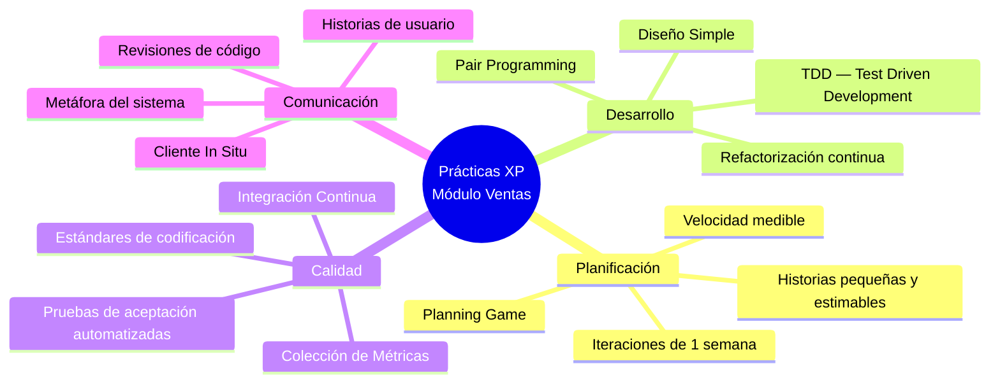

---

## 4. Iteraciones

### Iteración 0 — Preparación (Spike / Foundation)

**Duración**: 1 semana  
**Objetivo**: Sentar las bases técnicas y de arquitectura.  
**Puntos**: 0 (inversión técnica)

#### Tareas técnicas
- [ ] Configurar app Django `ventas` en `INSTALLED_APPS`
- [ ] Definir contratos iniciales de modelos con el cliente (dueño del producto)
- [ ] Configurar `pytest` con `DJANGO_SETTINGS_MODULE` y fixtures base
- [ ] Crear factory de datos de prueba (`catalogo` mínimo: País, Estado, Sucursal, Producto)
- [ ] Spike: validar `django-money` + `MoneyField` para campos monetarios
- [ ] Spike: validar integración básica con `djmoney` en el admin

#### Artefactos
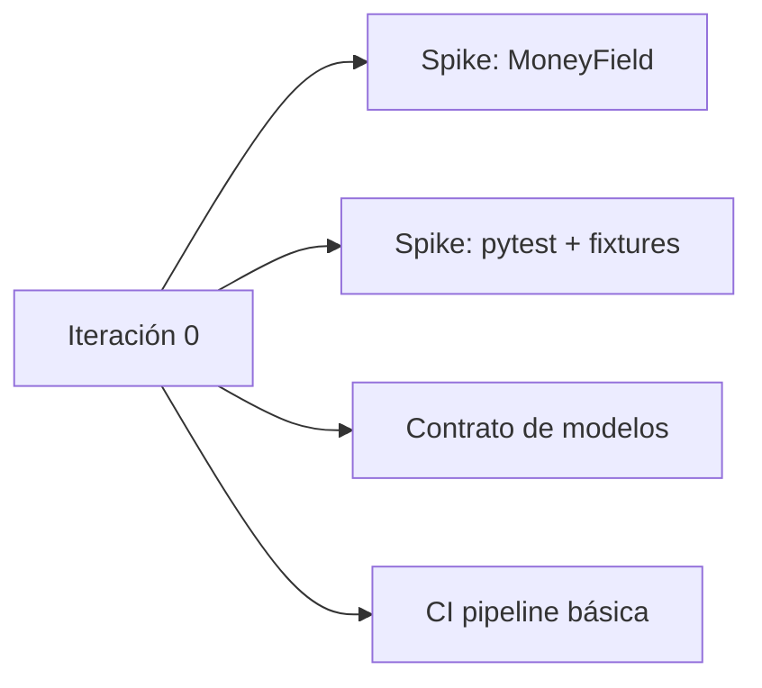

#### Definición de "Hecho" (DoD)
- [ ] Tests de configuración pasan (`pytest` ejecuta sin errores)
- [ ] Fixture base crea objetos de catálogo reutilizables
- [ ] Spike documenta decisiones técnicas (e.g., "usamos MoneyField en vez de Decimal")

---

### Iteración 1 — Catálogo de Clientes (US-01, US-10)

**Duración**: 1 semana  
**Puntos**: 8  
**Objetivo**: El usuario puede gestionar clientes con información de crédito y mercado.

#### Historias
1. **US-01**: CRUD de Cliente + límite de crédito
2. **US-10**: Clasificación por MercadoDestino + País

#### TDD — Ciclo Rojo-Verde-Refactor

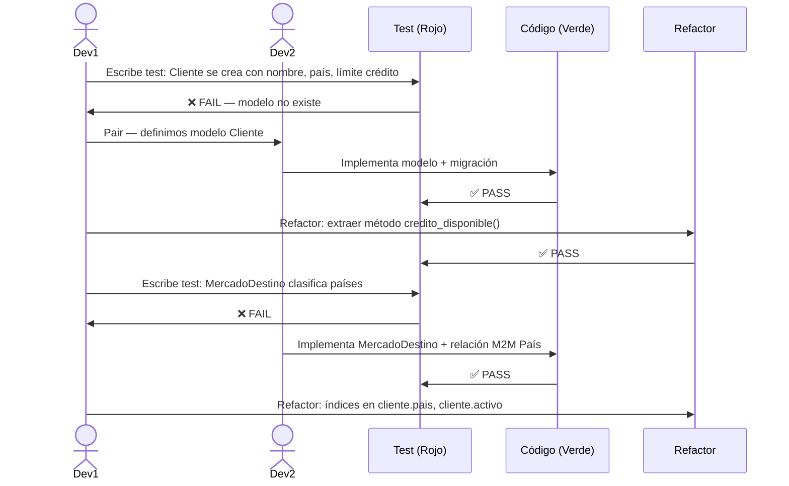

#### Tests clave
```python
# tests/test_cliente.py  — TDD
class ClienteTest(TestCase):
    def test_cliente_se_crea_con_limite_credito(self):
        cliente = Cliente.objects.create(
            nombre="Cliente A", pais=self.pais_mx, limite_credito=Money('50000', 'MXN')
        )
        self.assertEqual(str(cliente), "Cliente A - México")
        self.assertEqual(cliente.credito_disponible(), 50000.0)

    def test_cliente_contado_no_tiene_credito(self):
        cliente = Cliente.objects.create(
            nombre="Cliente B", pais=self.pais_mx, tipo_cliente='Contado'
        )
        self.assertEqual(cliente.credito_disponible(), 0)
```

#### Modelos entregados
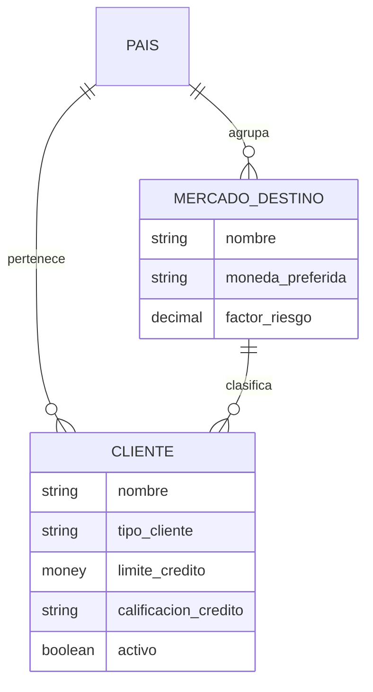

#### Demo al cliente
- [ ] Pantalla de admin: crear cliente, asignar mercado, ver límite de crédito
- [ ] Filtros por tipo de cliente y calificación

---

### Iteración 2 — Ventas de Contado (US-02)

**Duración**: 1 semana  
**Puntos**: 5  
**Objetivo**: Registrar ventas simples pagadas al momento.

#### Historia
- **US-02**: Venta con producto, cantidad, monto. Al guardar, estado = Pagado.

#### TDD
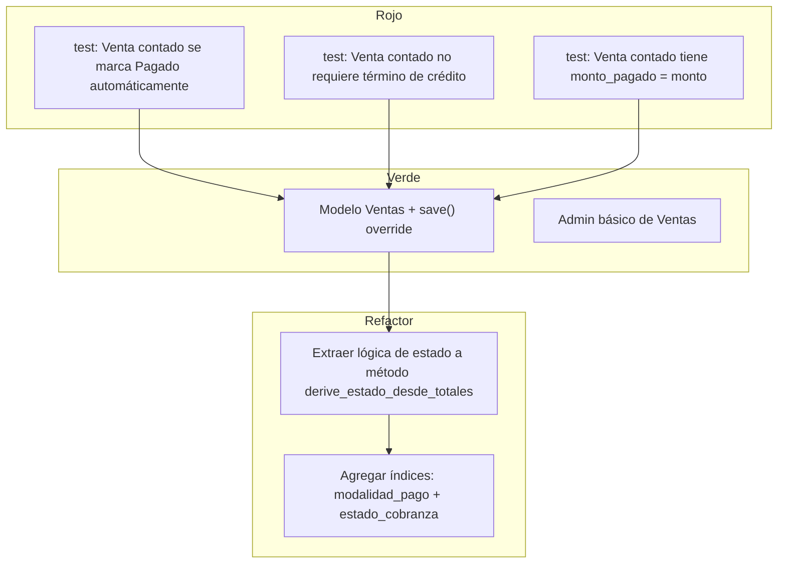

#### Tests clave
```python
def test_venta_contado_esta_pagada_al_crear(self):
    venta = Ventas.objects.create(
        cliente=self.cliente, producto=self.mango, cantidad=Decimal('1000.000'),
        monto=Money('45000', 'MXN'), modalidad_pago='Contado',
        fecha_salida_manifiesto=date.today(), fecha_deposito=date.today(),
        sucursal_id=self.sucursal, agente_id=self.agente, cuenta=self.cuenta,
        tipo_venta='Nacional', tipo_registro='VENTA'
    )
    self.assertEqual(venta.estado_cobranza, Ventas.EstadoCobranza.PAGADO)
    self.assertEqual(venta.monto_pagado, venta.monto)
```

#### Refactorización: Extracción de Servicio
> **Justificación**: El método `save()` está creciendo. XP prescribe refactorizar en verde.

```python
# Antes: lógica en Ventas.save()
# Después: servicio dedicado
class VentaEstadoService:
    @staticmethod
    def establecer_estado_inicial(venta):
        if venta.modalidad_pago == Ventas.ModalidadPago.CONTADO:
            venta.estado_cobranza = Ventas.EstadoCobranza.PAGADO
            venta.monto_pagado = venta.monto
```

---

### Iteración 3 — Ventas a Crédito y Términos (US-03)

**Duración**: 1 semana  
**Puntos**: 8  
**Objetivo**: Permitir ventas con pago diferido, calculando vencimiento automático.

#### Historias
- **US-03**: Venta a crédito + TerminoCredito + fecha_vencimiento auto

#### TDD — Test de cálculo de vencimiento
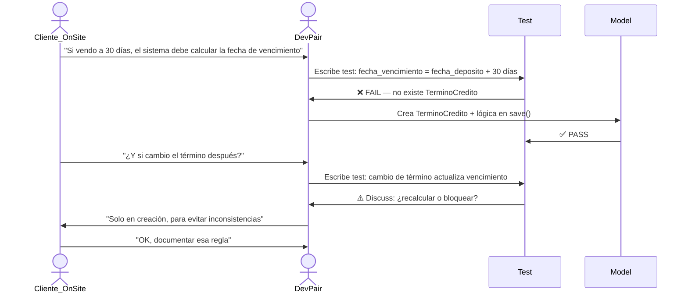

#### Tests clave
```python
def test_venta_credito_calcula_vencimiento(self):
    termino = TerminoCredito.objects.create(nombre='Net 30', dias_credito=30)
    venta = Ventas.objects.create(
        cliente=self.cliente, producto=self.mango,
        monto=Money('50000', 'MXN'), modalidad_pago='Credito',
        termino_credito=termino,
        fecha_deposito=date(2024, 1, 15),
        fecha_salida_manifiesto=date(2024, 1, 15),
        # ...otros campos requeridos
    )
    self.assertEqual(venta.fecha_vencimiento, date(2024, 2, 14))
    self.assertEqual(venta.estado_cobranza, Ventas.EstadoCobranza.PENDIENTE)
```

#### Diseño simple — Validaciones
> XP: "La mejor arquitectura es la que no existe todavía." Solo agregamos validaciones cuando el test lo exige.

```python
# clean() mínimo necesario para esta iteración
def clean(self):
    if self.modalidad_pago == self.ModalidadPago.CREDITO and not self.termino_credito:
        raise ValidationError({'termino_credito': 'Obligatorio para crédito.'})
```

---

### Iteración 4 — Pagos de Venta a Crédito (US-04, US-15)

**Duración**: 1 semana  
**Puntos**: 11  
**Objetivo**: Registrar pagos con integridad transaccional y auditoría.

#### Historias
- **US-04**: PagoVenta con validaciones bancarias (sin sobrepago, sin pagar lo ya pagado)
- **US-15**: Auditoría automática de cambio de estado

#### TDD — RF01-RF06 (Estándares Bancarios)

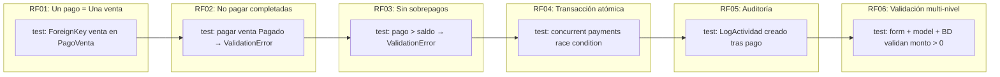

#### Tests clave — Integridad transaccional
```python
def test_pago_concurrente_no_sobrepaga(self):
    """RF04: select_for_update previene race condition."""
    venta = self._venta_credito(monto='10000.00')
    
    # Simular dos pagos simultáneos de $6,000 cada uno
    from concurrent.futures import ThreadPoolExecutor
    def intentar_pago(monto):
        try:
            with transaction.atomic():
                PagoVenta.objects.create(
                    venta=venta, monto_pago=Money(monto, 'MXN'),
                    cuenta_destino=self.cuenta, metodo_pago='Transferencia',
                    fecha_pago=date.today()
                )
            return 'ok'
        except ValidationError:
            return 'rejected'
    
    with ThreadPoolExecutor(max_workers=2) as ex:
        r1 = ex.submit(intentar_pago, '6000.00')
        r2 = ex.submit(intentar_pago, '6000.00')
        resultados = [r1.result(), r2.result()]
    
    self.assertIn('rejected', resultados)  # uno debe rechazarse
    venta.refresh_from_db()
    self.assertLessEqual(venta.monto_pagado.amount, 10000)
```

#### Refactorización — Extracción de estado
```python
# Refactor: mover lógica de estado a método derivado
@staticmethod
def derive_estado_desde_totales(total_ventas, total_pagado, fecha_vencimiento):
    saldo = total_ventas - total_pagado
    if saldo <= 0:
        return 'Pagado'
    vencida = fecha_vencimiento and fecha_vencimiento < timezone.now().date()
    if total_pagado > 0:
        return 'Vencido' if vencida else 'Parcial'
    return 'Vencido' if vencida else 'Pendiente'
```

---

### Iteración 5 — Anticipos y Aplicación a Ventas (US-05)

**Duración**: 1 semana  
**Puntos**: 8  
**Objetivo**: Gestionar anticipos de clientes y aplicarlos a ventas con validaciones estrictas.

#### Historias
- **US-05**: CRUD Anticipo + aplicación a venta (RF07-RF10)

#### TDD — Máquina de estados del anticipo

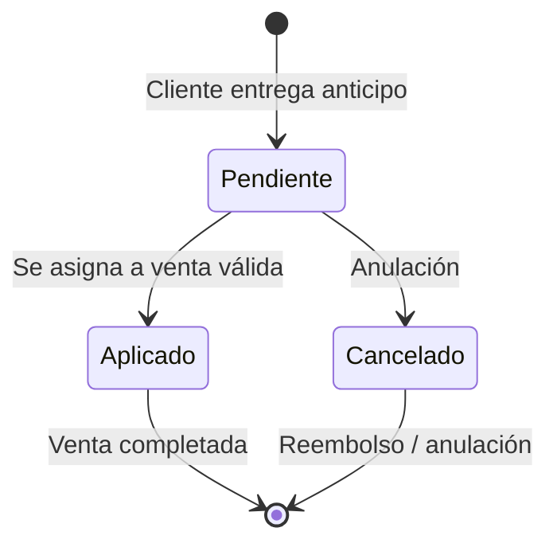

#### Tests clave — Reglas de negocio
```python
def test_anticipo_aplicado_mismo_cliente(self):
    """El anticipo debe ser del mismo cliente que la venta."""
    cliente_a = self._cliente('Cliente A')
    cliente_b = self._cliente('Cliente B')
    anticipo = self._anticipo(cliente_a, '5000.00')
    venta = self._venta_credito(cliente_b, monto='10000.00')
    
    with self.assertRaises(ValidationError):
        anticipo.aplicar_a_venta(venta)

def test_anticipo_no_aplicable_a_venta_pagada(self):
    """RF07: No asignar anticipo a venta completamente pagada."""
    venta = self._venta_contado(monto='5000.00')  # estado Pagado
    anticipo = self._anticipo(venta.cliente, '3000.00')
    
    with self.assertRaises(ValidationError):
        anticipo.aplicar_a_venta(venta)

def test_saldo_disponible_legacy(self):
    """Datos legacy: anticipo aplicado sin monto_aplicado debe reportar saldo 0."""
    anticipo = self._anticipo(self.cliente, '10000.00', estado='Aplicado')
    # Simular legacy: monto_aplicado = 0 pero estado = Aplicado
    anticipo.monto_aplicado = Money('0.00', 'MXN')
    anticipo.save()
    
    self.assertEqual(anticipo.saldo_disponible(), 0.0)  # no inflar saldo
```

#### Pair Programming — Discusión de diseño
> **Dev A**: "¿Dónde va la lógica de aplicación?"  
> **Dev B**: "En el modelo `Anticipo`, porque es su responsabilidad cambiar de estado."  
> **Dev A**: "¿Y la transacción?"  
> **Dev B**: "`aplicar_a_venta()` debe usar `transaction.atomic()` para mantener integridad."  
> **Cliente (onsite)**: "¿Puedo ver el saldo disponible del anticipo en la lista?"  
> **Dev A/B**: "Agregamos `saldo_disponible()` como property para el admin."

---

### Iteración 6 — Reporte de Cobranza Global (US-06)

**Duración**: 1 semana  
**Puntos**: 13  
**Objetivo**: Dashboard ejecutivo con saldos, aging, anticipos y exportación.

#### Historia
- **US-06**: Reporte de cobranza con filtros por fecha, tipo de cambio, distribución por estado y antigüedad

#### TDD — Desarrollo del servicio

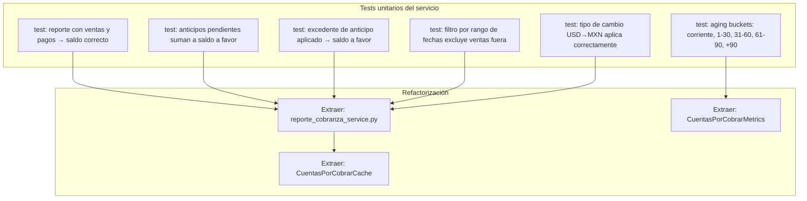

#### Tests clave — Saldo a favor
```python
def test_anticipo_aplicado_mayor_genera_excedente(self):
    """anticipo.monto > venta.monto → diferencia es saldo a favor."""
    cliente = self._cliente('Cliente Excedente')
    anticipo = self._anticipo(cliente, '10000.00')
    self._venta_credito(cliente, '8000.00', anticipo=anticipo)
    self._aplicar_anticipo(anticipo)
    
    datos = generar_reporte_cobranza()
    self.assertAlmostEqual(datos['total_anticipos'], 2000.0)
    self.assertAlmostEqual(datos['anticipos_por_cliente'][cliente.id], 2000.0)

def test_anticipo_pendiente_y_excedente_se_acumulan(self):
    cliente = self._cliente('Cliente Combo')
    self._anticipo(cliente, '3000.00')  # pendiente
    anticipo_app = self._anticipo(cliente, '10000.00')
    self._venta_credito(cliente, '8500.00', anticipo=anticipo_app)
    self._aplicar_anticipo(anticipo_app)  # excedente $1,500
    
    datos = generar_reporte_cobranza()
    self.assertAlmostEqual(datos['anticipos_por_cliente'][cliente.id], 4500.0)
```

#### Diseño emergente — Servicios
> XP: "Permite que el diseño de un sistema crezca gradualmente a medida que el sistema crece."

```python
# Servicio extraído tras 3er test duplicado
class CuentasPorCobrarMetrics:
    def __init__(self, ventas_qs, anticipos_qs):
        self.ventas = ventas_qs
        self.anticipos = anticipos_qs
    
    def saldo_a_favor_por_cliente(self):
        # Acumula anticipos pendientes + excedentes aplicados
        ...
    
    def aging_buckets(self):
        # Retorna dict: corriente, vencido_1, vencido_2, vencido_3
        ...
```

---

### Iteración 7 — Importación CFDI y Automatización (US-07)

**Duración**: 1 semana  
**Puntos**: 8  
**Objetivo**: Reducir captura manual importando facturas XML.

#### Historia
- **US-07**: Importar CFDI XML en 2 pasos (upload → confirmar → guardar)

#### TDD — Parser y matching

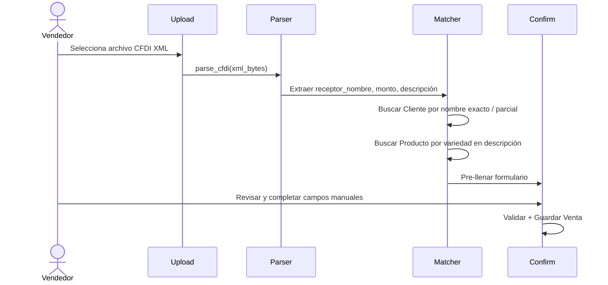

#### Tests clave
```python
def test_parse_cfdi_extrae_monto_y_moneda(self):
    xml = b'<?xml version="1.0"?><cfdi:Comprobante Total="45000.00" Moneda="USD" ...>'
    parsed = parse_cfdi(xml)
    self.assertEqual(parsed['monto'], Decimal('45000.00'))
    self.assertEqual(parsed['moneda_venta'], 'USD')

def test_match_cliente_por_nombre_exacto(self):
    Cliente.objects.create(nombre="EXPORTADORA DEL PACIFICO SA")
    parsed = {'_receptor_nombre': 'EXPORTADORA DEL PACIFICO SA'}
    match = match_cliente(parsed)
    self.assertIsNotNone(match)

def test_match_producto_por_variedad_en_descripcion(self):
    Producto.objects.create(nombre='Mango', variedad='Ataulfo', disponible=True)
    parsed = {'descripcion': 'CAJAS DE MANGO ATAULFO GRADO A'}
    match = match_producto(parsed)
    self.assertEqual(match.variedad, 'Ataulfo')
```

---

### Iteración 8 — Estado de Cuenta y Configuración (US-08, US-12)

**Duración**: 1 semana  
**Puntos**: 11  
**Objetivo**: Generar estados de cuenta por cliente y parametrizar el módulo.

#### Historias
- **US-08**: EstadoCuentaCliente con movimientos del período (ventas - abonos = saldo)
- **US-12**: ConfiguracionCuentasPorCobrar (días aging, alertas, tipo de cambio)

#### TDD — Estado de cuenta

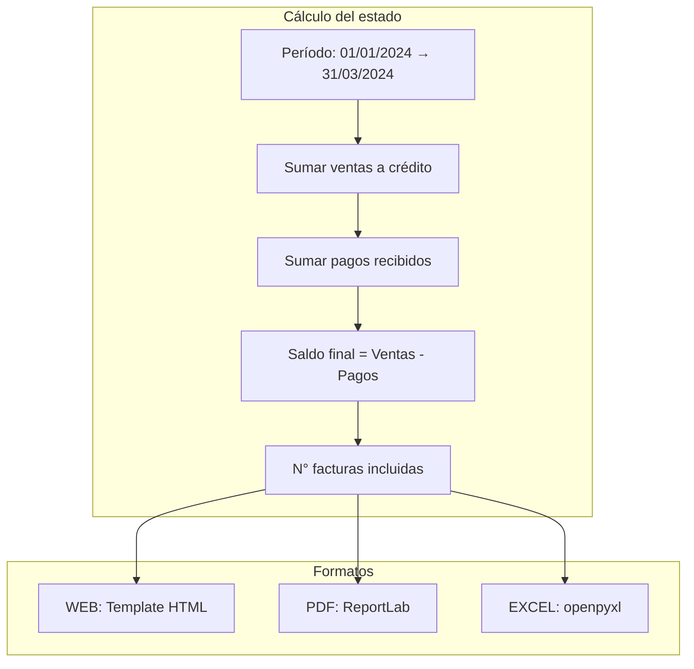

#### Tests clave
```python
def test_estado_cuenta_calcula_saldo_correcto(self):
    cliente = self._cliente('Cliente EC')
    self._venta_credito(cliente, monto='50000.00', fecha=date(2024, 1, 15))
    self._pago_venta(cliente, monto='20000.00', fecha=date(2024, 2, 1))
    
    ec = EstadoCuentaCliente.objects.create(
        cliente=cliente, periodo_inicio=date(2024, 1, 1), periodo_fin=date(2024, 3, 31),
        total_ventas=Money('50000', 'MXN'), total_abonos=Money('20000', 'MXN'),
        saldo_final=Money('30000', 'MXN'), numero_facturas=1, generado_por='test'
    )
    self.assertEqual(ec.porcentaje_recuperacion, 40.0)
    self.assertEqual(ec.nombre_archivo_sugerido(), "EstadoCuenta_Cliente EC_20240101_20240331")
```

---

### Iteración 9 — Aging y Caché (US-09, US-14)

**Duración**: 1 semana  
**Puntos**: 13  
**Objetivo**: Calcular antigüedad de saldos y optimizar rendimiento con caché.

#### Historias
- **US-09**: AntigüedadSaldo (snapshot diario/semanal por buckets)
- **US-14**: Cache automático e invalidación

#### TDD — Aging

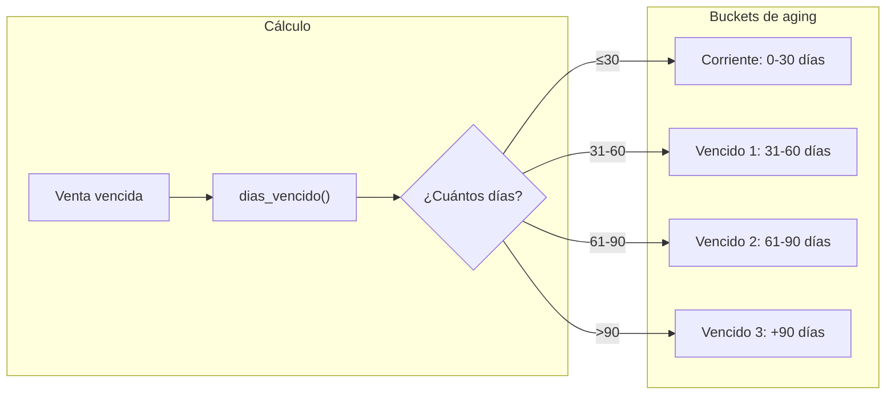

#### TDD — Cache
```python
@override_settings(CACHES={
    'default': {'BACKEND': 'django.core.cache.backends.locmem.LocMemCache'}
})
def test_cache_dashboard_se_invalida_al_registrar_pago(self):
    venta = self._venta_credito(monto='10000.00')
    cache.set('cxc_dashboard_ventas_principal', {'total': 10000}, 300)
    
    PagoVenta.objects.create(
        venta=venta, monto_pago=Money('5000', 'MXN'),
        cuenta_destino=self.cuenta, metodo_pago='Transferencia',
        fecha_pago=date.today()
    )
    
    self.assertIsNone(cache.get('cxc_dashboard_ventas_principal'))
```

---

### Iteración 10 — Exportación y Balances (US-13) + Refinamiento

**Duración**: 1 semana  
**Puntos**: 5  
**Objetivo**: Exportar datos a Excel y pulir el módulo.

#### Historia
- **US-13**: Exportar balances y reportes a Excel con formato profesional

#### TDD — Exportación Excel
```python
def test_exportar_ventas_a_excel_contiene_dos_hojas(self):
    self._venta_contado(monto='45000.00')
    response = exportar_balances_xlsx(self._request())
    
    from openpyxl import load_workbook
    wb = load_workbook(response)
    self.assertIn("Ventas", wb.sheetnames)
    self.assertIn("Cuentas por Cobrar", wb.sheetnames)
```

#### Refactorización final — Code Smells
> XP: "Refactoriza en cada iteración, no al final."

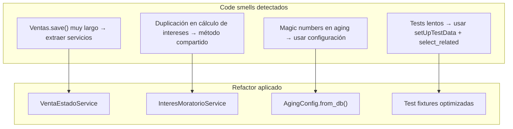

---

## 5. Roadmap Visual

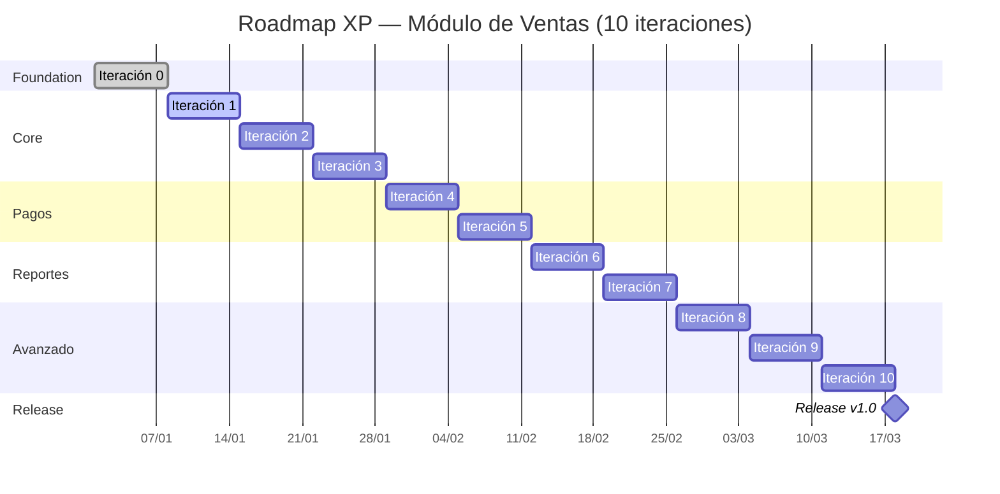

---

## 6. Métricas XP por Iteración

| Iteración | Velocidad (pts) | Tests nuevos | Cobertura | Deuda técnica |
|-----------|-----------------|--------------|-----------|---------------|
| 0 | 0 (spike) | 3 | — | Configuración base |
| 1 | 8 | 12 | 85% | — |
| 2 | 5 | 8 | 82% | — |
| 3 | 8 | 10 | 84% | Refactor save() |
| 4 | 11 | 18 | 88% | Extraer derive_estado() |
| 5 | 8 | 14 | 87% | — |
| 6 | 13 | 22 | 90% | Extraer servicios reporte |
| 7 | 8 | 10 | 85% | — |
| 8 | 11 | 12 | 86% | — |
| 9 | 13 | 16 | 89% | Cache abstraction |
| 10 | 5 | 6 | 91% | Polish & export |

**Velocidad promedio**: 9.9 pts/iteración  
**Tests totales**: ~131 tests  
**Cobertura final objetivo**: ≥ 90%

---

## 7. Integración Continua — Pipeline

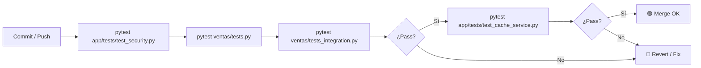

---

## 8. Checklist de Calidad XP

### Al inicio de cada iteración
- [ ] Planning Game con el cliente (dueño del producto)
- [ ] Historias descompuestas en tareas ≤ 4 horas
- [ ] Tests de aceptación definidos y acordados

### Durante la iteración
- [ ] Pair programming en lógica de negocio crítica (pagos, anticipos, reportes)
- [ ] TDD: test rojo → código mínimo → test verde → refactor
- [ ] Integración continua: push frecuente, pipeline verde
- [ ] Refactorización: una vez por día mínimo

### Al final de cada iteración
- [ ] Demo funcional al cliente
- [ ] Retrospectiva: ¿Qué funcionó? ¿Qué mejorar?
- [ ] Actualizar métricas de velocidad
- [ ] Revisión de cobertura de tests

---

## 9. Roles XP

| Rol | Responsable | En este proyecto |
|-----|-------------|------------------|
| **Cliente (Product Owner)** | Define historias, prioriza, acepta demos | Gerente comercial / Dueño |
| **Programadores** | Implementan, testean, refactorizan | Dev team |
| **Testers** | Ayudan a escribir tests de aceptación | Dev team (TDD) |
| **Tracker** | Mide velocidad, identifica bloqueos | Scrum master / Dev lead |
| **Coach XP** | Facilita prácticas, enseña TDD | Dev lead senior |

---

## 10. Lecciones Aprendidas (Post-mortem esperado)

> Aplicar al final del proyecto.

1. **TDD en operaciones monetarias**: Indispensable. Bugs en cálculo de saldos son costosos.
2. **Pair programming en RF04 (transacciones)**: Evitó race conditions difíciles de reproducir.
3. **Spike de django-money en Iteración 0**: Salvó tiempo posterior. Cambiar `Decimal` a `MoneyField` a mitad de proyecto sería doloroso.
4. **Cliente onsite para reglas de negocio**: La lógica de anticipos/excedentes cambió 2 veces. Sin presencia del cliente, se habrían generado retrabajos.
5. **Refactorización continua vs. al final**: El método `save()` de `Ventas` creció a 30 líneas en la iteración 3; se extrajo servicio inmediatamente. A la iteración 6 ya teníamos 3 servicios limpios.

---

*Documento generado para planificación ágil del módulo de ventas.*
