# Mockups del Módulo de Ventas

> Documento visual con wireframes, diagramas de flujo y mockups de pantallas del módulo **ventas**.  
> Generado con base en los modelos, admin, vistas, forms y services actuales del repositorio.

---

## 1. Modelo de Datos (Entidades principales)

```mermaid
erDiagram
    CLIENTE ||--o{ VENTAS : realiza
    CLIENTE ||--o{ ANTICIPO : genera
    CLIENTE ||--o{ SALDO_CLIENTE : posee
    CLIENTE ||--o{ ANTIGUEDAD_SALDO : analiza
    CLIENTE ||--o{ ESTADO_CUENTA_CLIENTE : reporta
    VENTAS ||--|| SALDO_CLIENTE : origina
    VENTAS ||--o{ PAGO_VENTA : recibe
    VENTAS ||--o| ANTICIPO : aplica
    AGENTE ||--o{ VENTAS : gestiona
    TERMINO_CREDITO ||--o{ VENTAS : define
    MERCADO_DESTINO ||--o{ CLIENTE : clasifica
    MERCADO_DESTINO ||--o{ VENTAS : destina
    PRODUCTO ||--o{ VENTAS : comercializa
    SUCURSAL ||--o{ VENTAS : opera
    CUENTA ||--o{ VENTAS : deposita
    CUENTA ||--o{ PAGO_VENTA : recibe
    CUENTA ||--o{ ANTICIPO : recibe
    CONFIGURACION_CXC ||--o{ ESTADO_CUENTA_CLIENTE : parametriza

    CLIENTE {
        string nombre
        string telefono
        string correo
        string direccion
        string tipo_cliente "Contado|Credito|Mixto"
        decimal limite_credito
        string calificacion_credito "A+|A|B|C"
        boolean activo
    }

    AGENTE {
        string nombre
        string telefono
        string correo
        date fecha_registro
    }

    TERMINO_CREDITO {
        string nombre
        int dias_credito
        decimal tasa_interes_mensual
        boolean activo
    }

    MERCADO_DESTINO {
        string nombre
        string moneda_preferida
        decimal factor_riesgo
        boolean requiere_documentacion_especial
    }

    ANTICIPO {
        money monto
        money monto_aplicado
        date fecha
        string estado_anticipo "Pendiente|Aplicado|Cancelado"
        string folio_factura_anticipo
    }

    VENTAS {
        date fecha_salida_manifiesto
        date fecha_deposito
        string pedimento
        string carga
        string PO
        decimal cantidad
        money monto
        string descripcion
        string tipo_venta "Nacional|Exportacion"
        string modalidad_pago "Contado|Credito"
        string estado_cobranza "Pagado|Pendiente|Parcial|Vencido|Incobrable"
        money monto_pagado
        date fecha_vencimiento
        string incoterm
        string moneda_venta
        decimal tipo_cambio
        string tipo_registro "VENTA|MAQUILA"
        string folio_factura
        string cfdi_cancelado
        string nota_credito
        string nota_cargo
        string numero_carga_comprador
        decimal ajuste
        date fecha_emision_cfdi
    }

    PAGO_VENTA {
        date fecha_pago
        money monto_pago
        string metodo_pago "Efectivo|Transferencia|Cheque|Tarjeta"
        string referencia
        string notas
        file comprobante_pago
    }

    SALDO_CLIENTE {
        money monto_original
        money saldo_pendiente
        date fecha_vencimiento
        date fecha_ultimo_pago
        string estado "PENDIENTE|PARCIAL|PAGADO|VENCIDO|INCOBRABLE"
        string moneda
        string notas
    }

    ANTIGUEDAD_SALDO {
        date fecha_calculo
        money corriente
        money vencido_1 "31-60d"
        money vencido_2 "61-90d"
        money vencido_3 "+90d"
        money total_saldo
        int numero_facturas
        float promedio_dias_pago
        string calculado_por
    }

    ESTADO_CUENTA_CLIENTE {
        date periodo_inicio
        date periodo_fin
        money total_ventas
        money total_abonos
        money saldo_final
        int numero_facturas
        string formato_generado "WEB|PDF|EXCEL"
        file archivo_generado
        string generado_por
    }

    CONFIGURACION_CXC {
        int dias_corriente default_30
        int dias_vencido_1 default_60
        int dias_vencido_2 default_90
        boolean calculo_automatico_aging
        time hora_calculo_aging
        string frecuencia_calculo "DIARIO|SEMANAL"
        boolean enviar_alertas_vencimiento
        int dias_previos_alerta
        string email_responsable_cobranza
        boolean permitir_sobregiro_credito
        float porcentaje_sobregiro_permitido
        decimal tipo_cambio_usd
    }
```

---

## 2. Flujo de Trabajo: Venta Contado vs Crédito

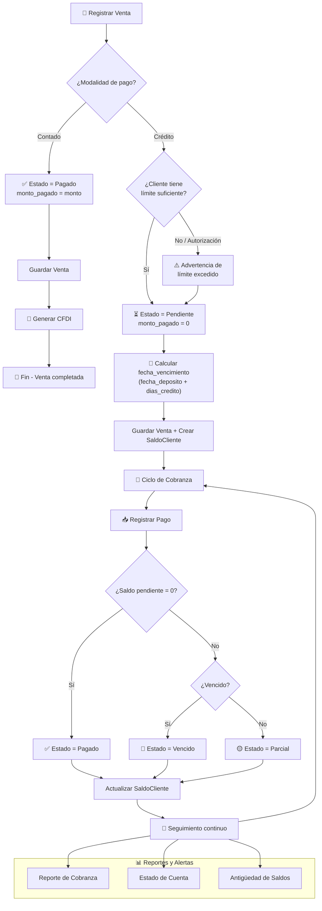

---

## 3. Flujo de Importación CFDI (2 pasos)

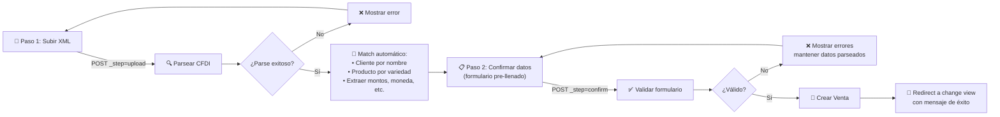

---

## 4. Flujo de Anticipos

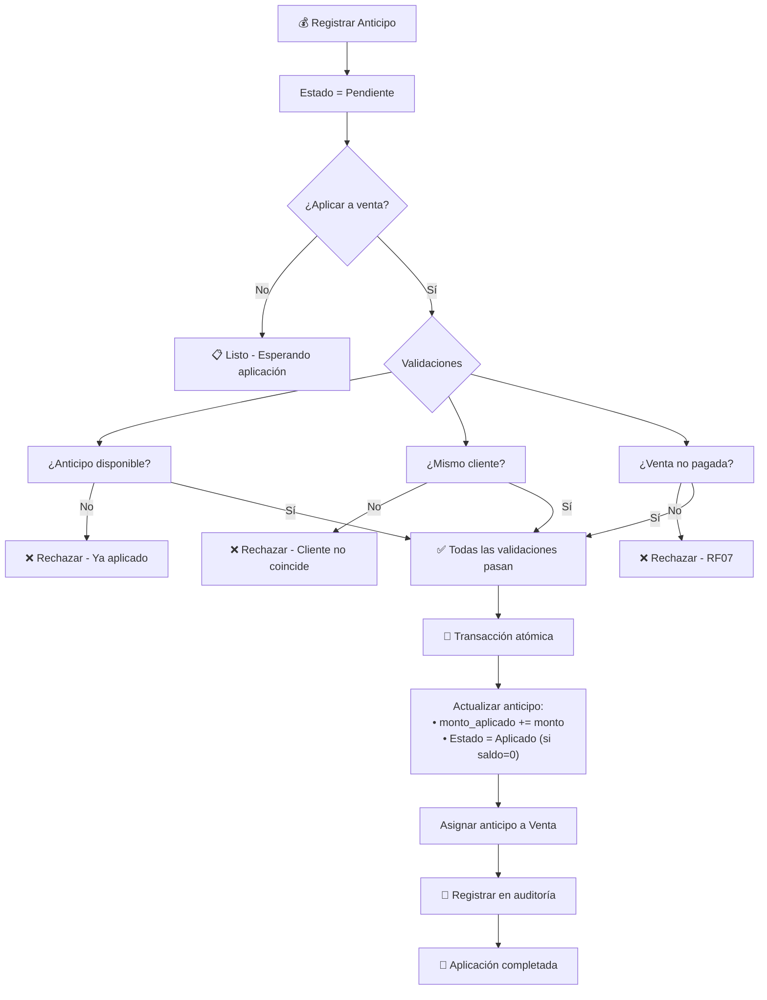

---

## 5. Flujo de Pagos (RF01-RF06)

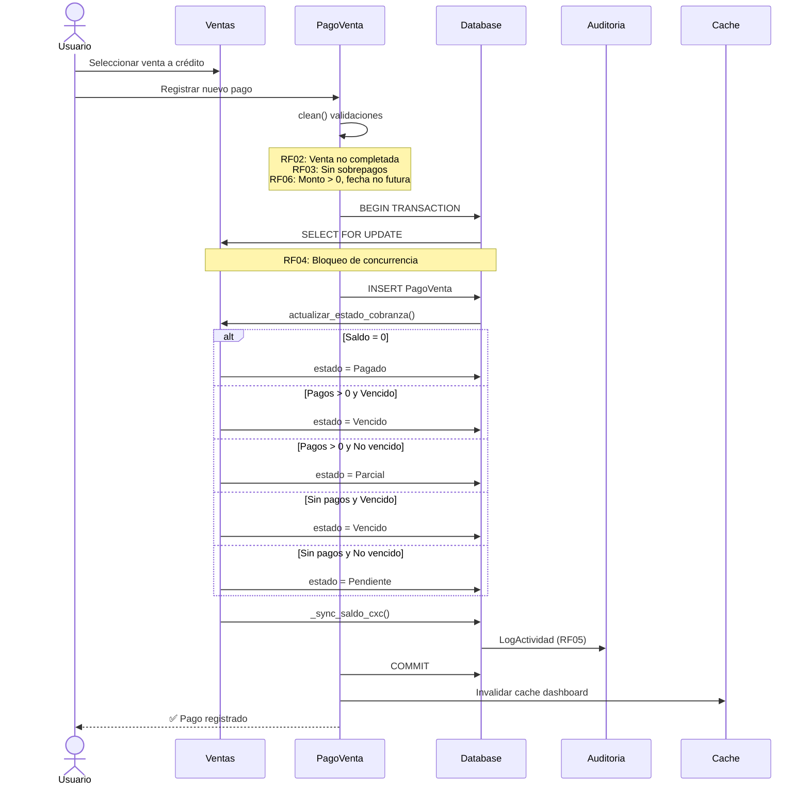

---

## 6. Mockup: Lista de Ventas (Admin Change List)

```mermaid
flowchart TB
    subgraph "Admin Ventas - Change List"
        direction TB
        
        subgraph "Header"
            H1["🔍 Buscador: carga, cliente, producto, PO, pedimento"]
            H2["📅 Date hierarchy: fecha_salida_manifiesto"]
        end
        
        subgraph "Filtros Lateral"
            F1["Vencimiento: Hoy / Semana / Mes / Vencido +30/60/90"]
            F2["Rango de Monto"]
            F3["Tipo registro: Venta | Maquila"]
            F4["Modalidad: Contado | Crédito"]
            F5["Estado cobranza"]
            F6["Tipo venta: Nacional | Exportación"]
            F7["Mercado destino"]
            F8["Término crédito"]
            F9["Calificación cliente"]
            F10["Tipo cliente"]
        end
        
        subgraph "Tabla Principal"
            T1["| Fecha Salida | Carga | Cliente & Riesgo | Monto | Modalidad | Estado | Vencimiento | Mercado | Saldo |"]
            T2["| 2024-01-15 | C-001 | 🟢 Cliente A (A+) | $50,000 | Crédito | 🔴 Vencido | +45 días | USA | $50,000 |"]
            T3["| 2024-01-20 | C-002 | 🔴 Cliente B (C) | $12,000 | Contado | 🟢 Pagado | - | Nacional | ✓ |"]
            T4["| 2024-02-01 | C-003 | 🟡 Cliente C (B) | $30,000 | Crédito | 🟡 Parcial | 15 días | Canadá | $15,000 |"]
        end
        
        subgraph "Acciones Masivas"
            A1["📊 Generar reporte por cliente"]
            A2["💰 Marcar como pagado"]
            A3["📄 Generar estado de cuenta"]
            A4["📧 Enviar notificación vencimiento"]
            A5["📤 Exportar cuentas vencidas"]
            A6["📥 Exportar a Excel"]
        end
        
        subgraph "KPIs Cards (Top)"
            K1["💵 Total Ventas: $X"]
            K2["💰 Total Pagado: $X"]
            K3["⚠️ Saldo Pendiente: $X"]
            K4["🔴 Vencidas: $X"]
        end
    end
    
    H1 --> T1
    H2 --> T1
    F1 --> T1
    A1 --> T1
    K1 --> T1
```

---

## 7. Mockup: Formulario de Venta (Admin Change Form)

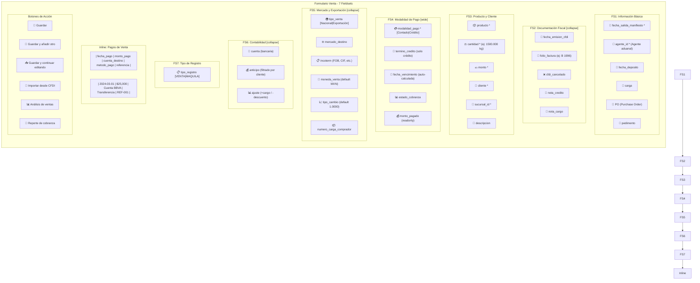

---

## 8. Mockup: Importación CFDI (2 pasos)

### Paso 1 - Subir XML
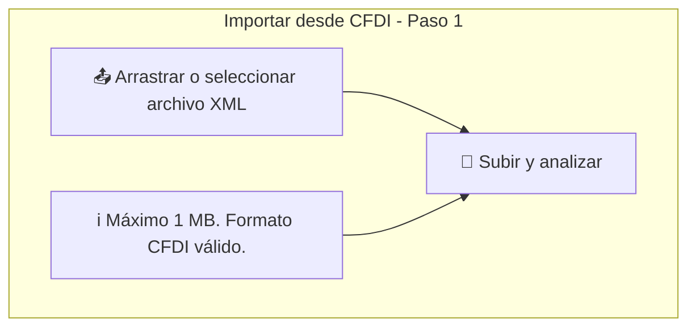

### Paso 2 - Confirmar Datos
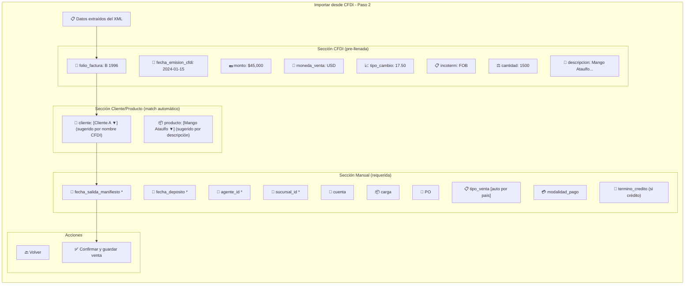

---

## 9. Mockup: Balances y Análisis de Ventas

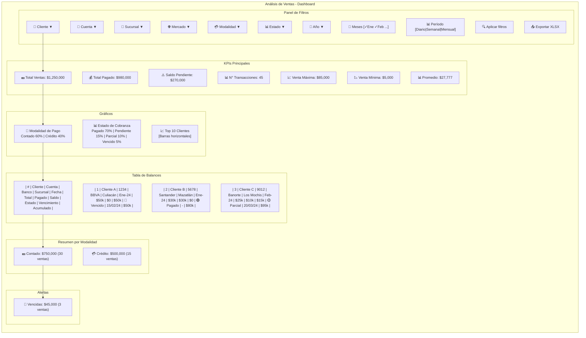

---

## 10. Mockup: Reporte de Cobranza Global

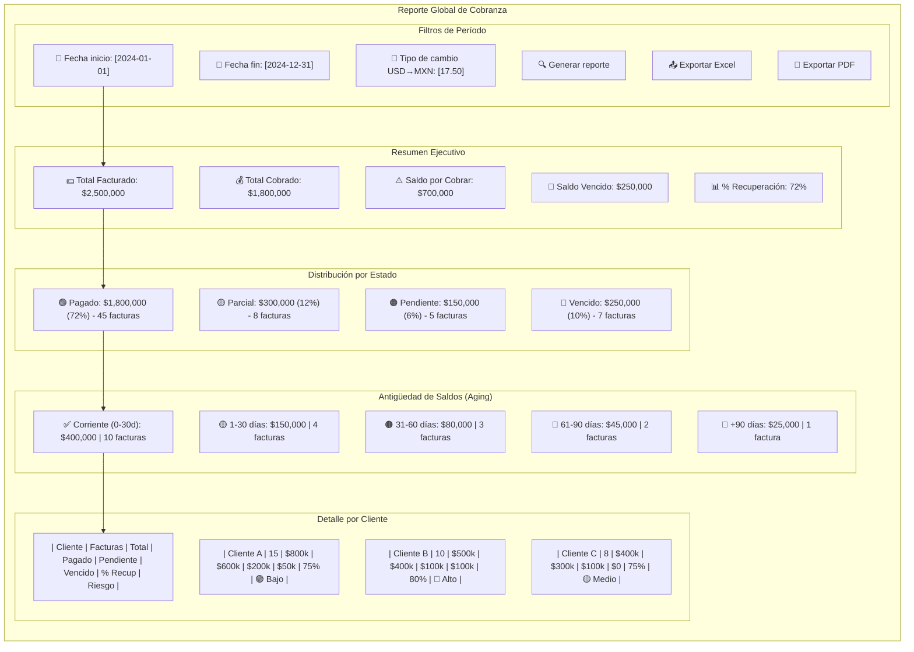

---

## 11. Mockup: Perfil de Cliente (Reporte Completo)

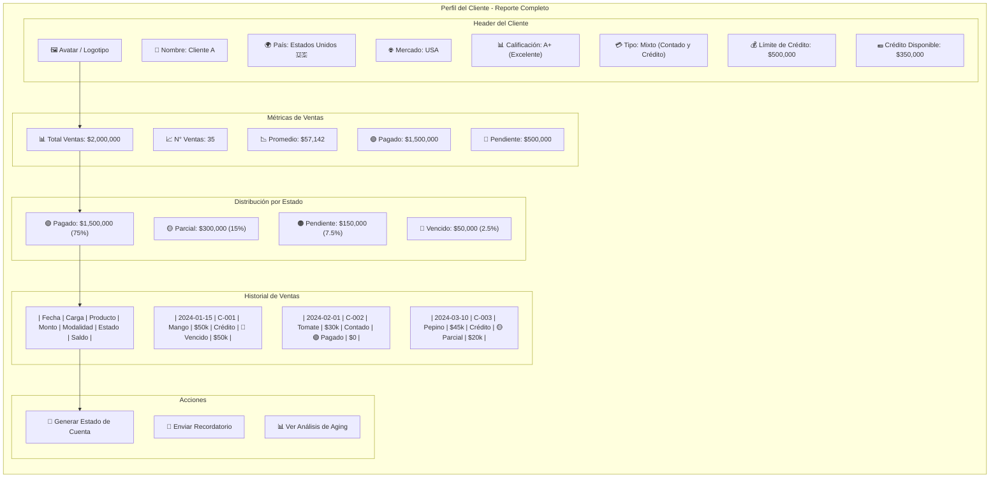

---

## 12. Mockup: Estado de Cuenta del Cliente

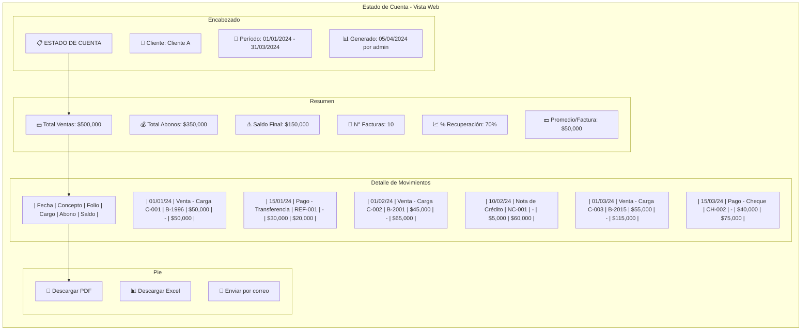

---

## 13. Mockup: Dashboard de Ventas (Admin)

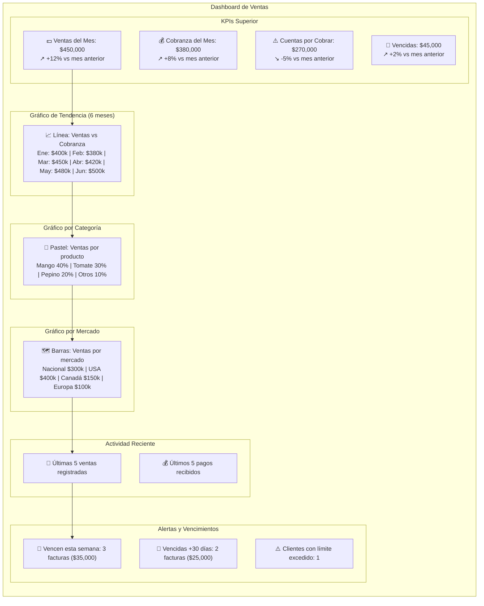

---

## 14. Mockup: Configuración Cuentas por Cobrar

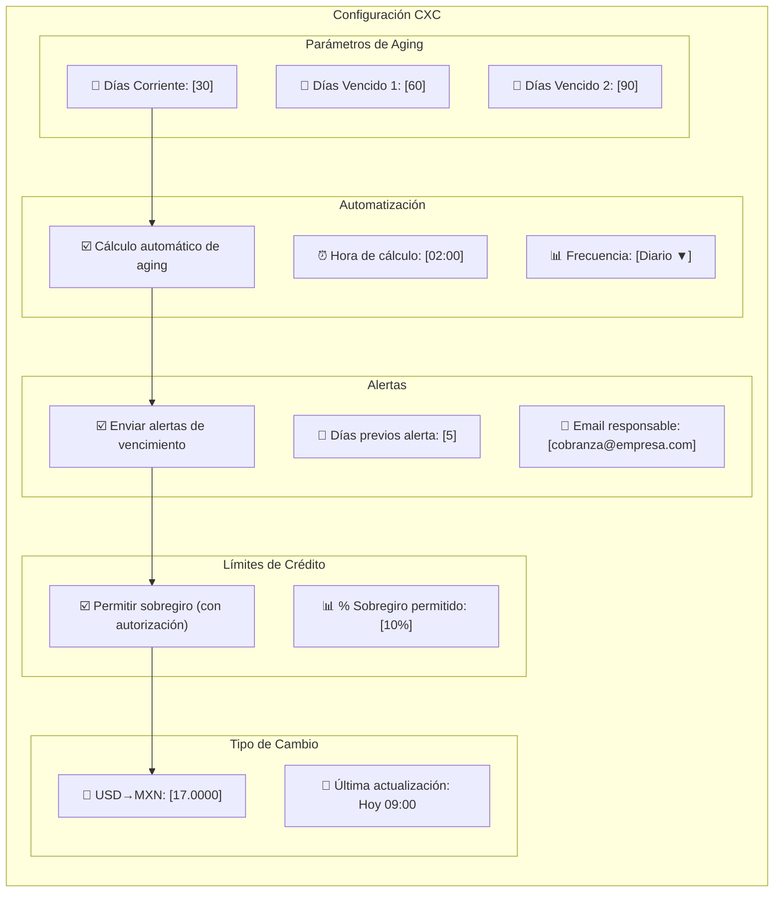

---

## 15. Diagrama de Estados - Cobranza

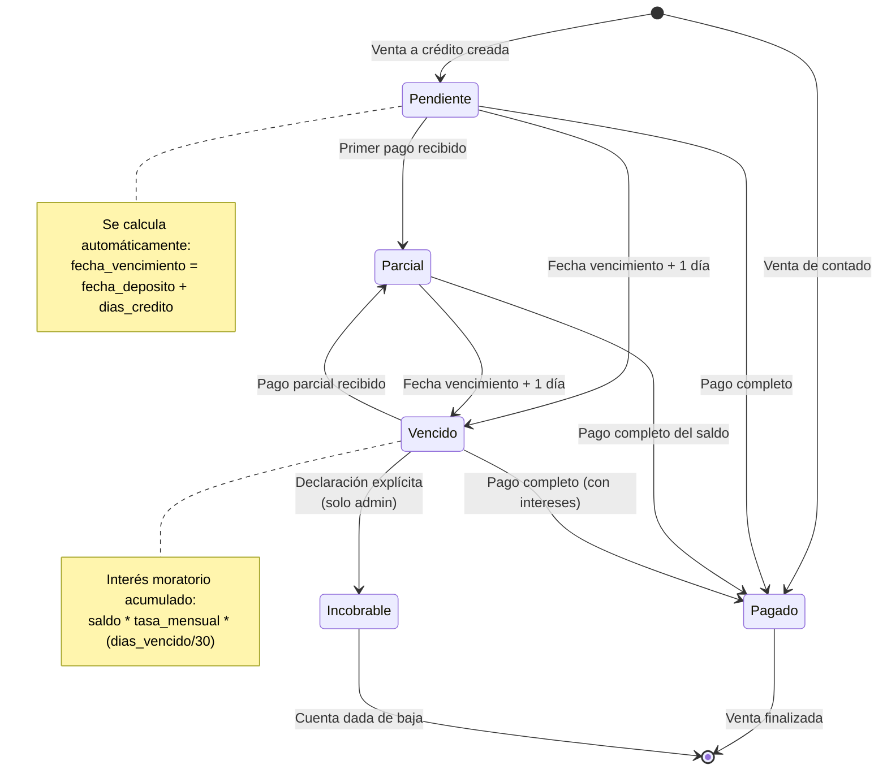

---

## 16. Arquitectura de Servicios (Ventas)

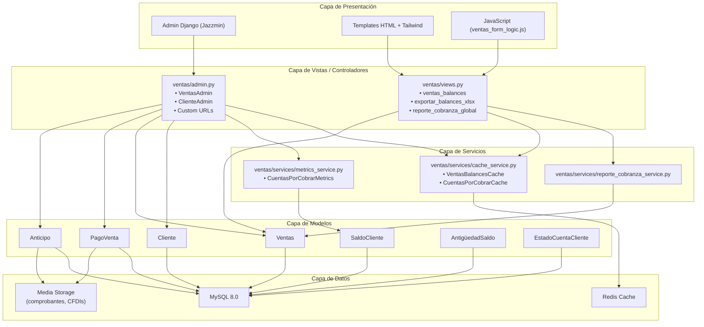

---

## Referencias

- Modelos: `ventas/models.py`
- Admin: `ventas/admin.py`
- Vistas: `ventas/views.py`
- Forms: `ventas/forms.py`
- URLs: `ventas/urls.py`
- Servicios: `ventas/services/`
- Templates: `templates/ventas/`

---

*Documento generado para referencia visual del módulo de ventas.*
