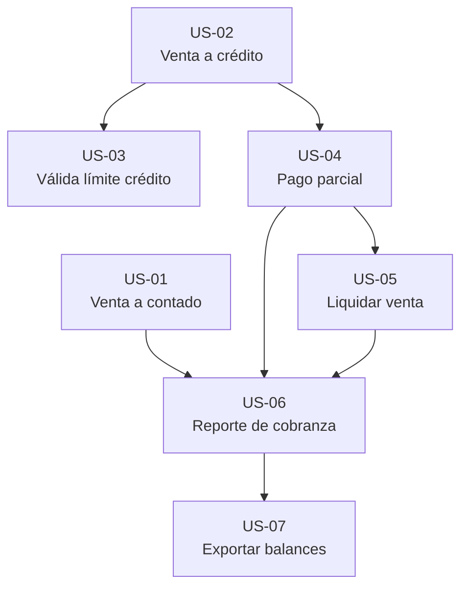
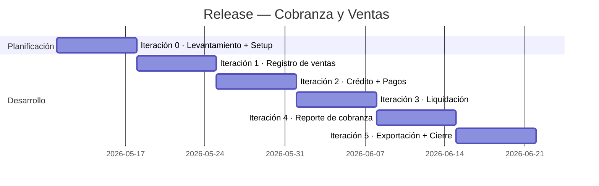

# Plan de Iteraciones XP — Cobranza y Ventas

> Planificación basada en **Extreme Programming (XP)** para el módulo de registro de ventas y cobranza del ERP _Agrícola de la Costa San Luis_.  
> Abarca US-01 a US-07 conforme al backlog refinado de cobranza.

---

## Nota sobre la Iteración 0 en XP

En la metodología XP pura, el **levantamiento de requerimientos** se realiza durante el **Planning Game** (Juego de Planificación), que es una reunión de release planning que ocurre **antes** de las iteraciones. En esa sesión el cliente prioriza y estima las historias, y el equipo define la velocidad. No es técnicamente una "iteración".

Sin embargo, en la práctica —especialmente en proyectos nuevos— es habitual usar una **Iteración 0** que combina:

| Actividad                         | ¿Dónde cae en XP puro?        | Iteración 0 (práctica) |
| --------------------------------- | ----------------------------- | ---------------------- |
| Entrevistas, historias de usuario | Planning Game (pre-iteración) | ✅ Incluida            |
| Criterios de aceptación           | Planning Game                 | ✅ Incluida            |
| Setup de entorno, CI, fixtures    | Spike / Iteración 0           | ✅ Incluida            |
| Decisiones de arquitectura        | Spike                         | ✅ Incluida            |

**Decisión adoptada**: se usa la **Iteración 0 como punto de partida unificado** que cubre tanto la captura inicial de requerimientos (Planning Game abreviado) como la preparación técnica. A partir de la Iteración 1 comienza el ciclo de desarrollo productivo.

---

## Product Backlog — Historias de Usuario

| ID    | Historia de usuario           | Rol                        | Puntos |
| ----- | ----------------------------- | -------------------------- | ------ |
| US-01 | Registrar venta a contado     | Gerente administrativo     | 3      |
| US-02 | Registrar venta a crédito     | Responsable de ventas      | 5      |
| US-03 | Validar límite de crédito     | Analista financiero        | 5      |
| US-04 | Registrar pago parcial        | Auxiliar de cobranza       | 8      |
| US-05 | Liquidar venta con pago total | Auxiliar de contabilidad   | 3      |
| US-06 | Consultar reporte de cobranza | Gerente administrativo     | 8      |
| US-07 | Exportar balances             | Responsable administrativo | 5      |

**Total estimado**: 37 puntos  
**Velocidad**: ~8–10 pts/iteración de 1 semana  
**Duración total**: Iteración 0 + 5 iteraciones de desarrollo ≈ **6 semanas**

---

## Mapa de dependencias



---

## Iteración 0 — Levantamiento y Preparación

**Duración**: 1 semana  
**Objetivo**: Levantar requerimientos, definir el backlog y preparar la base técnica.  
**Puntos productivos**: 0 (inversión de planificación y setup)

### Planning Game (Juego de Planificación)

- [ ] Sesión con el cliente para revisar y priorizar las 7 historias de usuario
- [ ] Confirmar criterios de aceptación por historia
- [ ] Acordar política de crédito: ¿advertencia o bloqueo duro? (US-03 C2)
- [ ] Definir columnas y formato esperado del Excel (US-07 C2)
- [ ] Establecer velocidad inicial: 8–10 puntos/semana

### Tareas técnicas (Spike)

- [ ] Verificar modelos existentes en `ventas/models.py` (Venta, PagoVenta, SaldoCliente)
- [ ] Confirmar campos `estado_cobranza`, `monto_pagado`, `saldo_pendiente` en el modelo `Venta`
- [ ] Verificar integración de `django-money` con `MoneyField` para montos
- [ ] Configurar fixtures base (`catalogo`: Producto, Cliente con límite_crédito, Sucursal)
- [ ] Preparar marcadores de prueba: `@pytest.mark.cobranza`
- [ ] Confirmar CI pipeline ejecuta `pytest ventas/` sin errores

### Definición de Hecho — Iteración 0

- [ ] Product Backlog priorizado y estimado
- [ ] Criterios de aceptación firmados con el cliente
- [ ] Entorno de desarrollo ejecuta el módulo `ventas` sin errores
- [ ] Suite de pruebas vacía pero ejecutable (`pytest ventas/tests.py` → 0 errors, 0 failures)

---

## Iteración 1 — Registro Base de Ventas

**Duración**: 1 semana  
**Historias**: US-01 + US-02 = **8 puntos**  
**Objetivo**: Establecer el ciclo de vida básico de una venta (contado y crédito) con sus estados iniciales.

### US-01 — Registrar venta a contado (3 pts)

> _Como gerente administrativo, quiero registrar una venta de contado para dejar cerrada la operación sin deuda pendiente._

| ID  | Criterio de aceptación                                                                                                           |
| --- | -------------------------------------------------------------------------------------------------------------------------------- |
| C1  | Dado un cliente activo, cuando se registra una venta a contado, entonces la venta queda guardada con `estado_cobranza = pagado`. |
| C2  | Dado un monto válido, cuando la venta se guarda, entonces `monto_pagado == monto_total`.                                         |
| C3  | Dado que la venta es de contado, cuando se consultan balances y reportes, entonces no genera saldo por cobrar.                   |

**Tareas técnicas**

- [ ] Implementar campo `tipo_venta` (contado/crédito) en modelo `Venta`
- [ ] Implementar lógica: al guardar contado → `estado_cobranza = 'pagado'`, `monto_pagado = monto_total`, `saldo_pendiente = 0`
- [ ] Agregar validación en `save()` o en el servicio de ventas
- [ ] Test unitario (TDD): `test_venta_contado_estado_pagado`
- [ ] Test unitario: `test_venta_contado_sin_saldo_cobrar`

**Test de aceptación**

```python
# TDD — escribe primero el test, luego implementa
def test_venta_contado_cierra_sin_deuda(venta_contado):
    assert venta_contado.estado_cobranza == 'pagado'
    assert venta_contado.monto_pagado == venta_contado.monto_total
    assert venta_contado.saldo_pendiente == Money(0, 'MXN')
```

---

### US-02 — Registrar venta a crédito (5 pts)

> _Como responsable de ventas, quiero registrar una venta a crédito para formalizar una operación cuya cobranza ocurrirá después._

| ID  | Criterio de aceptación                                                                                                               |
| --- | ------------------------------------------------------------------------------------------------------------------------------------ |
| C1  | Dado un cliente con término de crédito válido, cuando se registra la venta, entonces `fecha_vencimiento` se calcula automáticamente. |
| C2  | Dado que la venta es nueva y sin pagos, cuando se guarda, entonces `estado_cobranza = pendiente`.                                    |
| C3  | Dado que la venta es a crédito, cuando se persiste correctamente, entonces existe un saldo por cobrar (`saldo_pendiente > 0`).       |

**Tareas técnicas**

- [ ] Implementar campo `termino_credito_dias` en `Cliente` (si no existe)
- [ ] Implementar cálculo: `fecha_vencimiento = fecha_venta + timedelta(dias=cliente.termino_credito_dias)`
- [ ] Estado inicial de crédito: `estado_cobranza = 'pendiente'`, `monto_pagado = 0`, `saldo_pendiente = monto_total`
- [ ] Test unitario: `test_venta_credito_calcula_fecha_vencimiento`
- [ ] Test unitario: `test_venta_credito_estado_inicial_pendiente`
- [ ] Test unitario: `test_venta_credito_genera_saldo_cobrar`

**Test de aceptación**

```python
def test_venta_credito_crea_saldo(cliente_con_credito_30_dias, venta_credito):
    assert venta_credito.estado_cobranza == 'pendiente'
    assert venta_credito.saldo_pendiente == venta_credito.monto_total
    assert venta_credito.fecha_vencimiento == venta_credito.fecha_venta + timedelta(days=30)
```

### Definición de Hecho — Iteración 1

- [ ] Todos los tests de US-01 y US-02 pasan (`pytest -k "contado or credito"`)
- [ ] Admin de Django refleja el estado correcto en listado de ventas
- [ ] Demo al cliente: registrar una venta a contado y una a crédito en el admin
- [ ] Sin regresiones en módulos existentes (`pytest --tb=short`)

---

## Iteración 2 — Crédito y Pagos Parciales

**Duración**: 1 semana  
**Historias**: US-03 + US-04 = **13 puntos** (sobrepasa velocidad estándar — considerar extender a 1.5 semanas o reducir alcance de US-04 al estado parcial)  
**Objetivo**: Controlar el riesgo crediticio y registrar el avance de recuperación.

> **Nota de planificación**: US-04 tiene alta complejidad técnica (integridad transaccional). Si el equipo detecta al inicio de la iteración que el alcance es excesivo, se aplica el principio XP de **"cortar historia"**: implementar US-03 completo + US-04 C1 y C2; dejar C3 (trazabilidad) para Iteración 3.

### US-03 — Validar límite de crédito (5 pts)

> _Como analista financiero, quiero validar el crédito disponible del cliente antes de autorizar una venta para evitar sobreexposición._

| ID  | Criterio de aceptación                                                                                                                        |
| --- | --------------------------------------------------------------------------------------------------------------------------------------------- |
| C1  | Dado un cliente con ventas pendientes, cuando se consulta su crédito disponible, entonces el sistema descuenta el saldo vigente de su límite. |
| C2  | Dado un monto superior al crédito disponible, cuando se intenta aprobar la venta, entonces el sistema advierte o bloquea según política.      |
| C3  | Dado un cliente de contado, cuando se consulta crédito disponible, entonces el resultado es cero.                                             |

**Tareas técnicas**

- [ ] Implementar `credito_disponible` en modelo o servicio: `limite_credito - sum(saldo_pendiente activo)`
- [ ] Definir con el cliente la política: ¿advertencia (warning) o bloqueo duro? → Implementar según decisión de Iteración 0
- [ ] Test unitario: `test_credito_disponible_descuenta_saldo_vigente`
- [ ] Test unitario: `test_venta_excede_credito_genera_alerta`
- [ ] Test unitario: `test_cliente_contado_credito_disponible_es_cero`

**Test de aceptación**

```python
def test_credito_disponible_con_deuda(cliente_credito_1000, venta_credito_400):
    # saldo vigente = 400, límite = 1000
    assert cliente_credito_1000.credito_disponible == Money(600, 'MXN')

def test_cliente_contado_sin_credito(cliente_contado):
    assert cliente_contado.credito_disponible == Money(0, 'MXN')
```

---

### US-04 — Registrar pago parcial (8 pts)

> _Como auxiliar de cobranza, quiero registrar un pago parcial para reflejar el avance real de recuperación._

| ID  | Criterio de aceptación                                                                                                                         |
| --- | ---------------------------------------------------------------------------------------------------------------------------------------------- |
| C1  | Dado una venta a crédito pendiente, cuando se registra un abono menor al saldo, entonces `monto_pagado` aumenta y `estado_cobranza = parcial`. |
| C2  | Dado un pago parcial, cuando se consulta la venta y el saldo asociado, entonces ambos muestran el mismo saldo pendiente.                       |
| C3  | Dado un pago con referencia y cuenta destino, cuando se guarda, entonces el sistema conserva la trazabilidad del movimiento.                   |

**Tareas técnicas**

- [ ] Crear modelo `PagoVenta` con campos: `venta (FK)`, `monto`, `referencia`, `cuenta_destino`, `fecha`, `registrado_por`
- [ ] Implementar lógica transaccional en servicio: `registrar_pago(venta, monto, referencia, cuenta_destino)` usando `transaction.atomic()`
- [ ] Recalcular `monto_pagado` y `saldo_pendiente` tras cada pago
- [ ] Cambiar `estado_cobranza` a `'parcial'` si `0 < monto_pagado < monto_total`
- [ ] Test unitario: `test_pago_parcial_actualiza_monto_pagado`
- [ ] Test unitario: `test_pago_parcial_cambia_estado_a_parcial`
- [ ] Test unitario: `test_pago_parcial_saldo_consistente_en_venta_y_modelo`
- [ ] Test unitario: `test_pago_guarda_referencia_y_cuenta_destino`

**Test de aceptación**

```python
def test_pago_parcial_refleja_avance(venta_credito_1000):
    pago = registrar_pago(venta_credito_1000, Money(400, 'MXN'), ref='TRF-001', cuenta='BBVA')
    venta_credito_1000.refresh_from_db()
    assert venta_credito_1000.monto_pagado == Money(400, 'MXN')
    assert venta_credito_1000.saldo_pendiente == Money(600, 'MXN')
    assert venta_credito_1000.estado_cobranza == 'parcial'
    assert pago.referencia == 'TRF-001'
```

### Definición de Hecho — Iteración 2

- [ ] Tests de US-03 y US-04 pasan
- [ ] `transaction.atomic()` validado con rollback en caso de error
- [ ] Admin muestra `PagoVenta` como inline en `VentaAdmin`
- [ ] Política de crédito (advertencia/bloqueo) documentada y confirmada con el cliente
- [ ] Demo al cliente: consultar crédito disponible y registrar un abono parcial

---

## Iteración 3 — Liquidación de Ventas

**Duración**: 1 semana  
**Historias**: US-05 = **3 puntos** + tareas de integración y estabilización  
**Objetivo**: Cerrar el ciclo de vida de una venta al recibir el pago total.

### US-05 — Liquidar venta con pago total (3 pts)

> _Como auxiliar de contabilidad, quiero registrar el pago final de una venta para cerrarla financieramente._

| ID  | Criterio de aceptación                                                                                             |
| --- | ------------------------------------------------------------------------------------------------------------------ |
| C1  | Dado una venta con saldo pendiente, cuando la suma de pagos alcanza el total, entonces `estado_cobranza = pagado`. |
| C2  | Dado una venta liquidada, cuando se consulta su saldo, entonces `saldo_pendiente = 0`.                             |

**Tareas técnicas**

- [ ] Extender lógica de `registrar_pago`: si `monto_pagado >= monto_total` → `estado_cobranza = 'pagado'`, `saldo_pendiente = 0`
- [ ] Prevenir overpayment: validar que el abono no supere el saldo pendiente
- [ ] Test unitario: `test_pago_total_cambia_estado_a_pagado`
- [ ] Test unitario: `test_venta_liquidada_saldo_es_cero`
- [ ] Test de integración: `test_ciclo_completo_venta_credito_a_liquidada`

**Test de aceptación**

```python
def test_liquidar_venta(venta_credito_1000):
    registrar_pago(venta_credito_1000, Money(1000, 'MXN'), ref='LIQ-001', cuenta='BBVA')
    venta_credito_1000.refresh_from_db()
    assert venta_credito_1000.estado_cobranza == 'pagado'
    assert venta_credito_1000.saldo_pendiente == Money(0, 'MXN')
```

### Tareas de integración (buffer de iteración)

- [ ] Test de integración end-to-end: venta a crédito → pago parcial → liquidación
- [ ] Verificar que `credito_disponible` (US-03) se actualiza tras liquidación
- [ ] Auditoría: confirmar que `LogActividad` registra cada cambio de `estado_cobranza`
- [ ] Refactoring: extraer lógica de estado en `VentaStateService` si hay duplicación

### Definición de Hecho — Iteración 3

- [ ] Ciclo completo (pendiente → parcial → pagado) cubierto por tests
- [ ] `saldo_pendiente` nunca negativo (validación en servicio)
- [ ] Log de auditoría registra transiciones de estado
- [ ] Demo al cliente: flujo completo de una venta a crédito con pagos

---

## Iteración 4 — Reporte de Cobranza

**Duración**: 1 semana  
**Historias**: US-06 = **8 puntos**  
**Objetivo**: Proveer al gerente visibilidad total del estado de la cartera.

### US-06 — Consultar reporte de cobranza (8 pts)

> _Como gerente administrativo, quiero consultar el reporte global de cobranza para priorizar seguimiento y riesgo._

| ID  | Criterio de aceptación                                                                                                                            |
| --- | ------------------------------------------------------------------------------------------------------------------------------------------------- |
| C1  | Dado un periodo y filtros operativos, cuando se genera el reporte, entonces se visualizan totales, distribución por estado y detalle por cliente. |
| C2  | Dado ventas vencidas, cuando se consulta el reporte, entonces estas se identifican visualmente de forma clara.                                    |

**Tareas técnicas**

- [ ] Implementar view `ReporteCobranzaView` con filtros: periodo, estado, cliente, sucursal
- [ ] Calcular en queryset o servicio: total por cobrar, total pagado, total vencido
- [ ] Identificar ventas vencidas: `fecha_vencimiento < hoy AND estado_cobranza != 'pagado'`
- [ ] Diseñar template con tabla de detalle + resumen de totales por estado
- [ ] Destacar visualmente filas vencidas (clase CSS `vencida` o badge rojo)
- [ ] Test unitario: `test_reporte_filtra_por_periodo`
- [ ] Test unitario: `test_reporte_identifica_ventas_vencidas`
- [ ] Test de vista: respuesta 200, contexto contiene totales

**Test de aceptación**

```python
def test_reporte_muestra_vencidas(client, venta_vencida, venta_pendiente):
    response = client.get(reverse('ventas:reporte_cobranza'), {'estado': 'todas'})
    assert response.status_code == 200
    assert venta_vencida in response.context['ventas_vencidas']
    assert response.context['total_vencido'] > Money(0, 'MXN')
```

### Definición de Hecho — Iteración 4

- [ ] Reporte accesible desde el admin con permisos adecuados
- [ ] Ventas vencidas diferenciadas visualmente
- [ ] Totales cuadran con suma de registros mostrados
- [ ] Demo al cliente: navegar el reporte con filtros y confirmar layout

---

## Iteración 5 — Exportación y Estabilización

**Duración**: 1 semana  
**Historias**: US-07 = **5 puntos** + cierre del release  
**Objetivo**: Habilitar exportación a Excel y consolidar la calidad del módulo.

### US-07 — Exportar balances (5 pts)

> _Como responsable administrativo, quiero exportar balances filtrados a Excel para conciliación y análisis fuera del sistema._

| ID  | Criterio de aceptación                                                                                                                              |
| --- | --------------------------------------------------------------------------------------------------------------------------------------------------- |
| C1  | Dado un conjunto de filtros válidos, cuando se ejecuta la exportación, entonces el archivo contiene exactamente los registros visibles en pantalla. |
| C2  | Dado una exportación exitosa, cuando se abre el archivo, entonces existen columnas: cliente, cuenta, fecha, totales, saldo y estado.                |
| C3  | Dado que no hay registros, cuando se exporta, entonces el archivo se genera vacío sin corromper el flujo del usuario.                               |

**Tareas técnicas**

- [ ] Extender `ExcelService` (ya existe en `app/services/excel_service.py`) con método `exportar_balances_ventas`
- [ ] Columnas requeridas: Cliente, Cuenta/Sucursal, Fecha, Monto Total, Monto Pagado, Saldo Pendiente, Estado
- [ ] Aplicar mismos filtros activos del reporte (US-06) a la exportación
- [ ] Manejar queryset vacío: generar archivo con encabezados y sin filas
- [ ] Test unitario: `test_exportacion_contiene_columnas_requeridas`
- [ ] Test unitario: `test_exportacion_sin_registros_no_falla`
- [ ] Test de integración: `test_exportacion_coincide_con_reporte`

**Test de aceptación**

```python
def test_exportacion_balances(client, tres_ventas_variadas):
    response = client.get(reverse('ventas:exportar_balances'))
    assert response.status_code == 200
    assert 'application/vnd.openxmlformats' in response['Content-Type']
    wb = openpyxl.load_workbook(BytesIO(response.content))
    ws = wb.active
    headers = [cell.value for cell in ws[1]]
    assert 'Cliente' in headers
    assert 'Saldo Pendiente' in headers
    assert 'Estado' in headers

def test_exportacion_vacia_no_falla(client):
    response = client.get(reverse('ventas:exportar_balances'))
    assert response.status_code == 200  # sin ventas, sin error
```

### Tareas de cierre del release

- [ ] Revisión de cobertura: `pytest --cov=ventas --cov-report=term-missing`
- [ ] Eliminar código muerto o comentado de iteraciones anteriores
- [ ] Actualizar traducciones en `locale/es/LC_MESSAGES/django.po` para nuevas etiquetas
- [ ] Documentar decisiones de diseño (política de crédito, estados de cobranza)
- [ ] Retrospectiva: ¿Qué salió bien? ¿Qué mejorar en próximo release?

### Definición de Hecho — Iteración 5

- [ ] US-07 C1, C2 y C3 pasan como tests automáticos
- [ ] Cobertura de tests en `ventas/` ≥ 80%
- [ ] Sin errores en `pytest app/tests/test_security.py` para vistas nuevas
- [ ] Exportación disponible con mismos permisos que el reporte (US-06)
- [ ] Demo final al cliente: ciclo completo + reporte + descarga Excel

---

## Resumen del Release



| Iteración | Historias       | Puntos | Objetivo principal            |
| --------- | --------------- | ------ | ----------------------------- |
| 0         | —               | 0      | Levantamiento + Setup técnico |
| 1         | US-01, US-02    | 8      | Registro base de ventas       |
| 2         | US-03, US-04    | 13     | Crédito + Pagos parciales     |
| 3         | US-05           | 3      | Liquidación + integración     |
| 4         | US-06           | 8      | Reporte de cobranza           |
| 5         | US-07           | 5      | Exportación + cierre          |
| **Total** | **7 historias** | **37** |                               |

> Iteración 2 excede la velocidad estándar (13 vs ~10 pts). Si el equipo lo detecta al inicio, se aplica la práctica XP de **cortar historia**: mover US-04-C3 (trazabilidad) a Iteración 3.

---

## Prácticas XP por iteración

| Práctica              | I0  | I1  | I2  | I3  | I4  | I5  |
| --------------------- | --- | --- | --- | --- | --- | --- |
| Planning Game         | ✅  | —   | —   | —   | —   | —   |
| TDD (test-first)      | —   | ✅  | ✅  | ✅  | ✅  | ✅  |
| Pair Programming      | —   | ✅  | ✅  | ✅  | —   | ✅  |
| Integración Continua  | ✅  | ✅  | ✅  | ✅  | ✅  | ✅  |
| Diseño Simple (YAGNI) | —   | ✅  | ✅  | ✅  | ✅  | —   |
| Refactoring           | —   | —   | —   | ✅  | —   | ✅  |
| Demo al cliente       | —   | ✅  | ✅  | ✅  | ✅  | ✅  |
| Retrospectiva         | —   | —   | —   | —   | —   | ✅  |
