# Plan XP — Módulo de Ventas

> Planificación ágil basada en **Extreme Programming (XP)** para el desarrollo del módulo `ventas` del ERP *Agrícola de la Costa*.  
> Aplica prácticas de las skills: `mermaid-diagrams` y `xp-practices`.

---

## 1. Metáfora del Sistema

**Metáfora**: *"El módulo de ventas es el libro mayor digital del comerciante agrícola: registra cada carga que sale del campo, quién la compró, cuánto debe, cuándo vence, y alerta cuando alguien no ha pagado."*

---

## 2. Visión

Permitir al equipo comercial registrar, rastrear y cobrar ventas de productos agrícolas (nacionales y de exportación), gestionar la cartera de clientes, anticipos y cuentas por cobrar, con auditoría completa e integración con facturación electrónica CFDI.

---

## 3. Product Backlog — Historias de Usuario

| ID | Historia | Valor | Riesgo | Est. (pts) |
|----|----------|-------|--------|------------|
| US-01 | Como *vendedor*, quiero registrar un cliente con datos básicos y límite de crédito. | Alto | Bajo | 3 |
| US-02 | Como *vendedor*, quiero registrar una venta de contado con producto, cantidad y monto. | Alto | Bajo | 5 |
| US-03 | Como *vendedor*, quiero registrar una venta a crédito con fecha de vencimiento auto-calculada. | Alto | Medio | 8 |
| US-04 | Como *contador*, quiero registrar pagos parciales de una venta a crédito con integridad transaccional. | Alto | Alto | 8 |
| US-05 | Como *vendedor*, quiero registrar un anticipo de cliente y aplicarlo a una venta. | Alto | Alto | 8 |
| US-06 | Como *gerente*, quiero ver un reporte de cobranza con saldos pendientes, vencidos y aging. | Alto | Medio | 13 |
| US-07 | Como *vendedor*, quiero importar datos de una factura CFDI XML para evitar captura manual. | Medio | Medio | 8 |
| US-08 | Como *contador*, quiero generar un estado de cuenta por cliente con movimientos del período. | Medio | Medio | 8 |
| US-09 | Como *gerente*, quiero ver análisis de antigüedad de saldos (aging) para evaluar riesgo crediticio. | Medio | Medio | 8 |
| US-10 | Como *vendedor*, quiero clasificar clientes por mercado de destino (Nacional, USA, etc.). | Medio | Bajo | 5 |
| US-11 | Como *sistema*, quiero calcular automáticamente intereses moratorios en ventas vencidas. | Medio | Medio | 5 |
| US-12 | Como *administrador*, quiero configurar días de aging y alertas de vencimiento. | Bajo | Bajo | 3 |
| US-13 | Como *vendedor*, quiero exportar balances de ventas a Excel con formato profesional. | Medio | Bajo | 5 |
| US-14 | Como *sistema*, quiero invalidar caché automáticamente al registrar pagos para datos actualizados. | Medio | Medio | 5 |
| US-15 | Como *auditor*, quiero que cada cambio de estado de cobranza se registre en el log de actividad. | Alto | Bajo | 3 |

**Total estimado**: 97 puntos  
**Velocidad esperada**: ~10 pts/iteración → **~10 iteraciones de 1 semana**

---

## 4. Prácticas XP Aplicadas

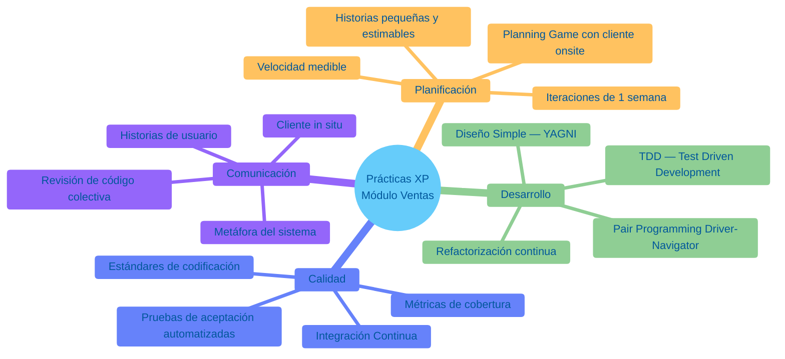

### Pair Programming — Modalidad

**Driver-Navigator** en lógica de negocio crítica (pagos, anticipos, reportes).  
**Ping-Pong TDD** en servicios de cálculo:

```
Dev A: Escribe test rojo
Dev B: Hace pasar + refactor + escribe siguiente test rojo
Dev A: Hace pasar + refactor + escribe siguiente test rojo
... (rotar cada 20-30 min)
```

---

## 5. Arquitectura del Dominio — ERD

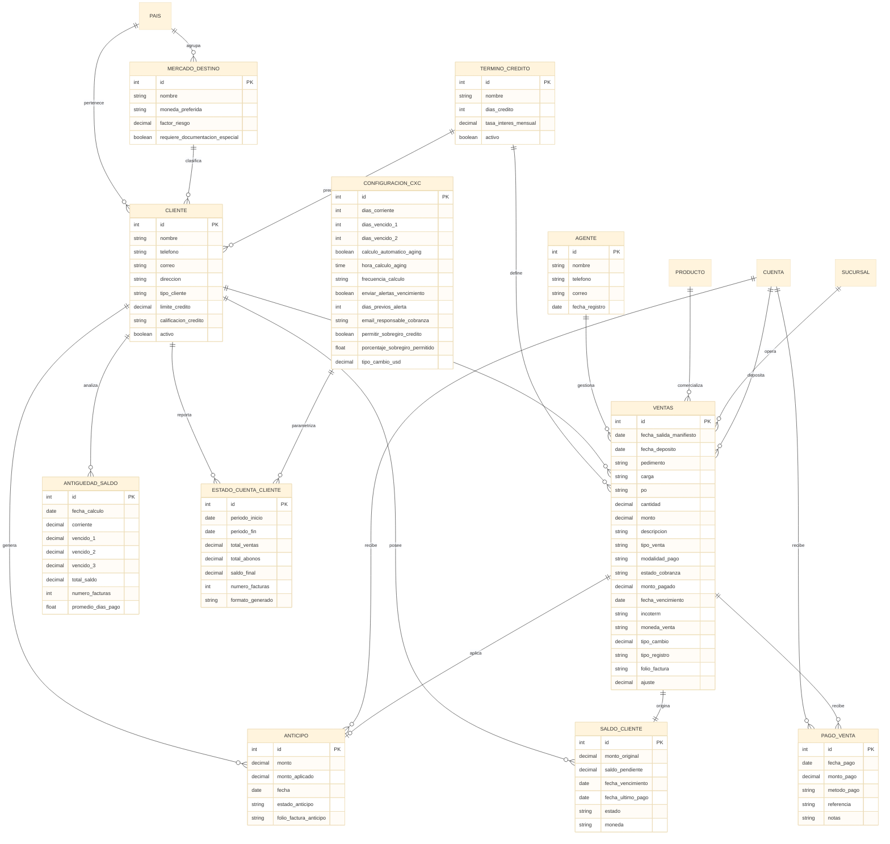

---

## 6. Iteraciones

### Iteración 0 — Foundation (Spike)

**Duración**: 1 semana  
**Puntos**: 0 (inversión técnica)  
**Prácticas XP**: Spike, TDD setup, CI pipeline

#### Objetivo
Sentar bases técnicas antes de escribir lógica de negocio.

#### Tareas
- [ ] Configurar app `ventas` en `INSTALLED_APPS`
- [ ] Spike: validar `django-money` + `MoneyField` (monetario crítico)
- [ ] Configurar `pytest` con `DJANGO_SETTINGS_MODULE` y fixtures base
- [ ] Crear factory de datos: `Pais`, `Estado`, `Sucursal`, `Producto`, `Banco`, `Cuenta`
- [ ] CI pipeline: ejecutar `pytest` + `flake8` en cada push
- [ ] Definir contrato de modelos con cliente (dueño del producto)

#### Definition of Done
- [ ] `pytest` ejecuta sin errores de configuración
- [ ] Fixture base crea objetos reutilizables en `< 100 ms`
- [ ] Spike documenta decisión: "Usamos `MoneyField` en vez de `Decimal` para evitar inconsistencias de moneda"

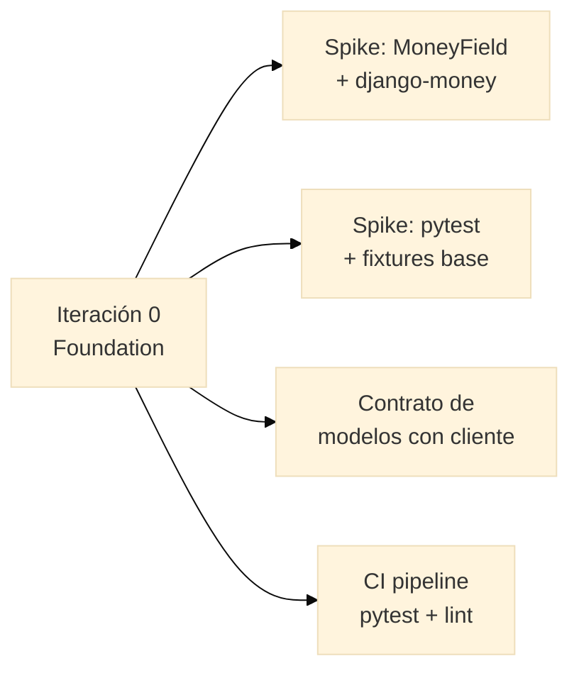

---

### Iteración 1 — Catálogo de Clientes (US-01, US-10)

**Duración**: 1 semana  
**Puntos**: 8  
**Prácticas XP**: TDD, Pair Programming, Diseño Simple

#### Historias
- **US-01**: CRUD de `Cliente` + límite de crédito + calificación
- **US-10**: Clasificación por `MercadoDestino` + `País`

#### TDD — Ping-Pong Pairing

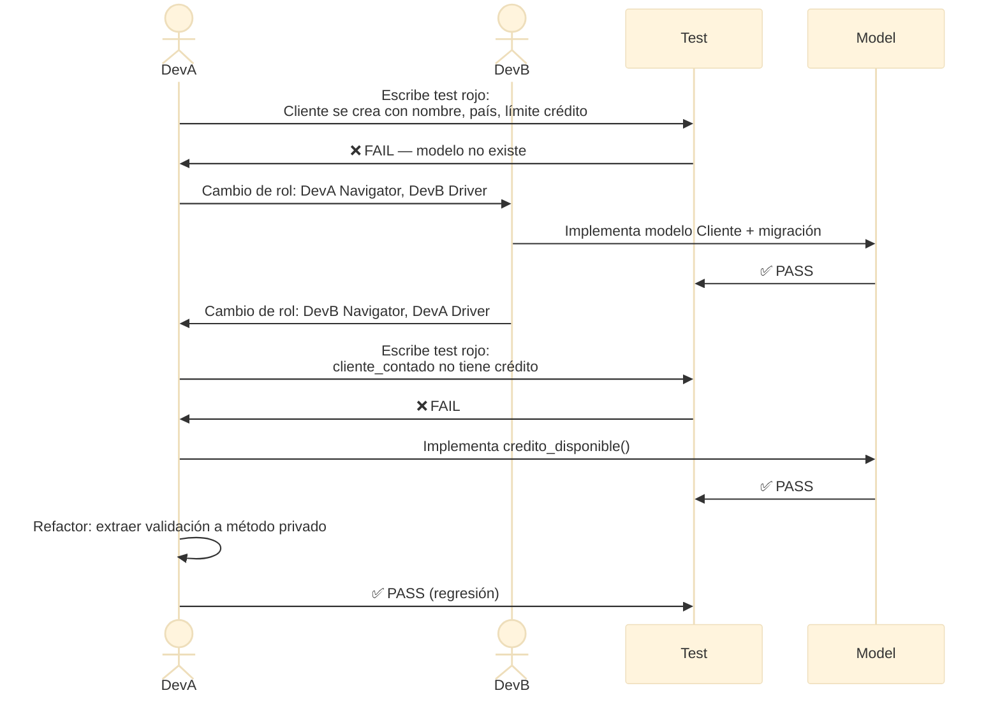

#### Tests clave
```python
class ClienteTest(TestCase):
    def test_cliente_se_crea_con_limite_credito(self):
        cliente = Cliente.objects.create(
            nombre="Cliente A", pais=self.pais_mx,
            limite_credito=Money('50000', 'MXN')
        )
        self.assertEqual(str(cliente), "Cliente A - México")
        self.assertEqual(cliente.credito_disponible(), 50000.0)

    def test_cliente_contado_no_tiene_credito(self):
        cliente = Cliente.objects.create(
            nombre="Cliente B", pais=self.pais_mx, tipo_cliente='Contado'
        )
        self.assertEqual(cliente.credito_disponible(), 0)
```

#### DoD
- [ ] Admin funcional con filtros por tipo y calificación
- [ ] Cobertura ≥ 85%
- [ ] Demo al cliente: crear cliente, asignar mercado, ver límite

---

### Iteración 2 — Ventas de Contado (US-02)

**Duración**: 1 semana  
**Puntos**: 5  
**Prácticas XP**: TDD, Refactorización continua

#### Historia
- **US-02**: Venta con producto, cantidad, monto. Al guardar → estado = `Pagado`.

#### TDD — Ciclo Rojo-Verde-Refactor

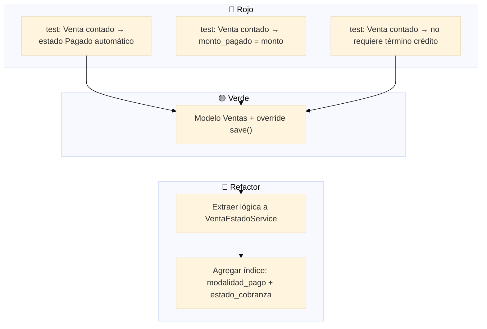

#### Refactorización — Extracción de servicio
```python
class VentaEstadoService:
    @staticmethod
    def establecer_estado_inicial(venta):
        if venta.modalidad_pago == Ventas.ModalidadPago.CONTADO:
            venta.estado_cobranza = Ventas.EstadoCobranza.PAGADO
            venta.monto_pagado = venta.monto
```

---

### Iteración 3 — Ventas a Crédito (US-03)

**Duración**: 1 semana  
**Puntos**: 8  
**Prácticas XP**: TDD, Cliente onsite, Diseño Simple

#### Historia
- **US-03**: Venta a crédito + `TerminoCredito` + `fecha_vencimiento` auto-calculada

#### TDD — Cliente onsite

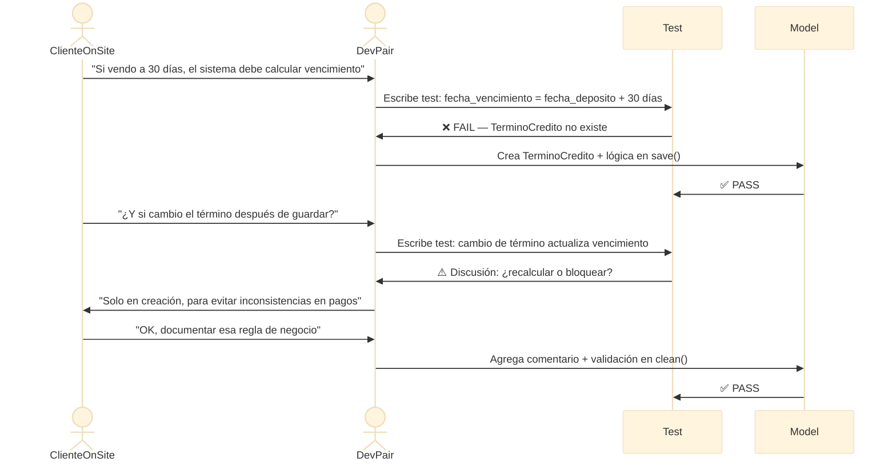

#### DoD
- [ ] Validación en `clean()`: crédito requiere término
- [ ] `fecha_vencimiento` se calcula automáticamente en `save()`
- [ ] Cobertura ≥ 84%

---

### Iteración 4 — Pagos con Integridad Transaccional (US-04, US-15)

**Duración**: 1 semana  
**Puntos**: 11  
**Prácticas XP**: TDD, Pair Programming (siempre en código crítico), Diseño Simple

#### Historias
- **US-04**: `PagoVenta` con estándares bancarios RF01-RF06
- **US-15**: Auditoría automática de cambio de estado

#### TDD — Estándares Bancarios

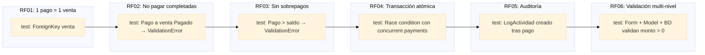

#### Test crítico — RF04 Race Condition
```python
def test_pago_concurrente_no_sobrepaga(self):
    """RF04: select_for_update previene race condition."""
    venta = self._venta_credito(monto='10000.00')

    from concurrent.futures import ThreadPoolExecutor
    def intentar_pago(monto):
        try:
            with transaction.atomic():
                PagoVenta.objects.create(
                    venta=venta, monto_pago=Money(monto, 'MXN'),
                    cuenta_destino=self.cuenta,
                    metodo_pago='Transferencia', fecha_pago=date.today()
                )
            return 'ok'
        except ValidationError:
            return 'rejected'

    with ThreadPoolExecutor(max_workers=2) as ex:
        r1 = ex.submit(intentar_pago, '6000.00')
        r2 = ex.submit(intentar_pago, '6000.00')
        resultados = [r1.result(), r2.result()]

    self.assertIn('rejected', resultados)
    venta.refresh_from_db()
    self.assertLessEqual(venta.monto_pagado.amount, 10000)
```

#### Refactorización — Fuente de verdad única
```python
@staticmethod
def derive_estado_desde_totales(total_ventas, total_pagado, fecha_vencimiento):
    """Fuente de verdad única para estado de cobranza."""
    saldo = total_ventas - total_pagado
    if saldo <= 0:
        return 'Pagado'
    vencida = fecha_vencimiento and fecha_vencimiento < timezone.now().date()
    if total_pagado > 0:
        return 'Vencido' if vencida else 'Parcial'
    return 'Vencido' if vencida else 'Pendiente'
```

---

### Iteración 5 — Anticipos y Aplicación (US-05)

**Duración**: 1 semana  
**Puntos**: 8  
**Prácticas XP**: TDD, Pair Programming, State Machine

#### Historia
- **US-05**: CRUD `Anticipo` + aplicación a venta (RF07-RF10)

#### Diagrama de estados — Anticipo

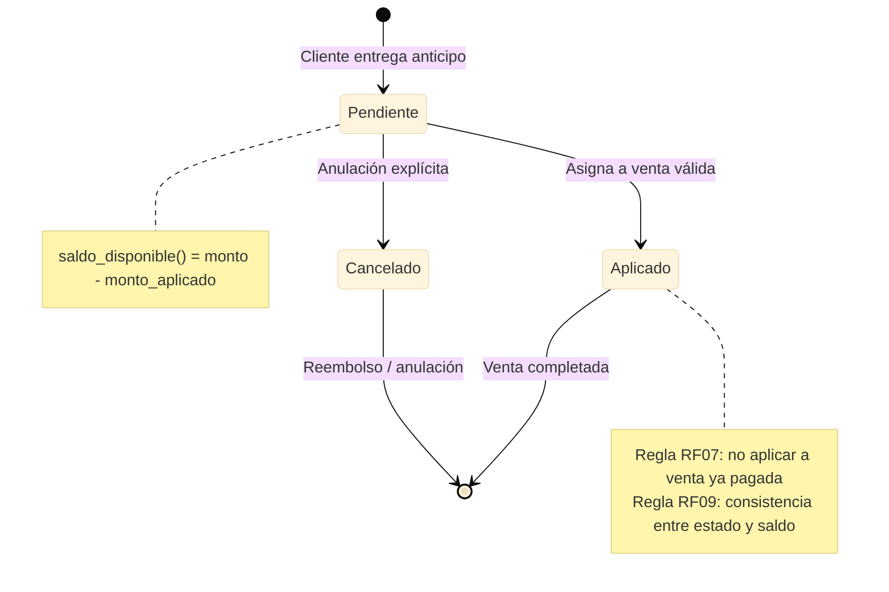

#### Tests clave — RF07-RF10
```python
def test_anticipo_aplicado_mismo_cliente(self):
    cliente_a = self._cliente('Cliente A')
    cliente_b = self._cliente('Cliente B')
    anticipo = self._anticipo(cliente_a, '5000.00')
    venta = self._venta_credito(cliente_b, monto='10000.00')
    with self.assertRaises(ValidationError):
        anticipo.aplicar_a_venta(venta)

def test_saldo_disponible_legacy(self):
    """Legacy: anticipo Aplicado sin monto_aplicado → saldo 0."""
    anticipo = self._anticipo(self.cliente, '10000.00', estado='Aplicado')
    anticipo.monto_aplicado = Money('0.00', 'MXN')
    anticipo.save()
    self.assertEqual(anticipo.saldo_disponible(), 0.0)
```

---

### Iteración 6 — Reporte de Cobranza Global (US-06)

**Duración**: 1 semana  
**Puntos**: 13  
**Prácticas XP**: TDD, Diseño Emergente, Refactorización

#### Historia
- **US-06**: Dashboard ejecutivo con saldos, aging, anticipos, exportación

#### TDD — Servicio de reporte (Diseño Emergente)

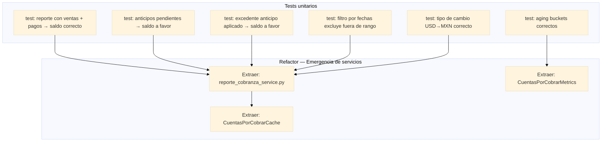

> **XP — Diseño Simple**: "La mejor arquitectura es la que no existe todavía." Solo extraemos servicios cuando 3 tests duplican la misma lógica.

#### Test — Saldo a favor con acumulación
```python
def test_anticipo_pendiente_y_excedente_se_acumulan(self):
    cliente = self._cliente('Cliente Combo')
    self._anticipo(cliente, '3000.00')  # pendiente
    anticipo_app = self._anticipo(cliente, '10000.00')
    self._venta_credito(cliente, '8500.00', anticipo=anticipo_app)
    self._aplicar_anticipo(anticipo_app)  # excedente $1,500

    datos = generar_reporte_cobranza()
    self.assertAlmostEqual(datos['anticipos_por_cliente'][cliente.id], 4500.0)
```

---

### Iteración 7 — Importación CFDI (US-07)

**Duración**: 1 semana  
**Puntos**: 8  
**Prácticas XP**: TDD, Spike (parser), Diseño Simple

#### Historia
- **US-07**: Importar CFDI XML en 2 pasos (upload → confirmar → guardar)

#### Flujo — 2 pasos

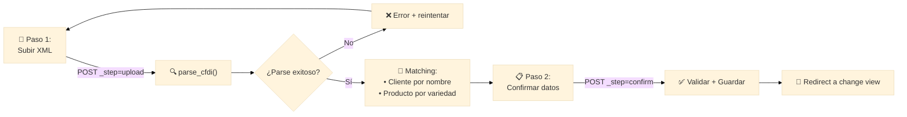

#### Tests
```python
def test_parse_cfdi_extrae_monto_y_moneda(self):
    xml = b'<cfdi:Comprobante Total="45000.00" Moneda="USD" ...>'
    parsed = parse_cfdi(xml)
    self.assertEqual(parsed['monto'], Decimal('45000.00'))
    self.assertEqual(parsed['moneda_venta'], 'USD')

def test_match_cliente_por_nombre_exacto(self):
    Cliente.objects.create(nombre="EXPORTADORA DEL PACIFICO SA")
    parsed = {'_receptor_nombre': 'EXPORTADORA DEL PACIFICO SA'}
    self.assertIsNotNone(match_cliente(parsed))
```

---

### Iteración 8 — Estado de Cuenta y Configuración (US-08, US-12)

**Duración**: 1 semana  
**Puntos**: 11  
**Prácticas XP**: TDD, Configuración parametrizable

#### Historias
- **US-08**: `EstadoCuentaCliente` con movimientos del período
- **US-12**: `ConfiguracionCuentasPorCobrar` singleton

#### Cálculo del estado de cuenta

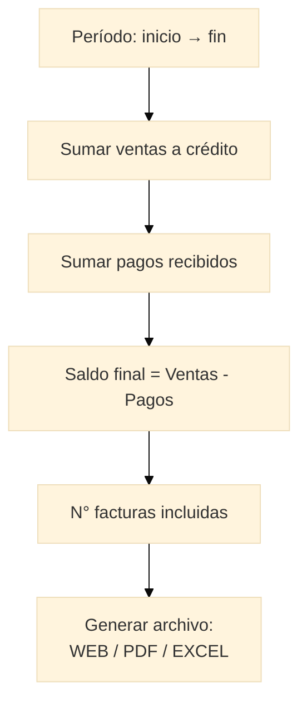

#### Tests
```python
def test_estado_cuenta_calcula_saldo_correcto(self):
    cliente = self._cliente('Cliente EC')
    self._venta_credito(cliente, monto='50000.00', fecha=date(2024, 1, 15))
    self._pago_venta(cliente, monto='20000.00', fecha=date(2024, 2, 1))

    ec = EstadoCuentaCliente.objects.create(
        cliente=cliente,
        periodo_inicio=date(2024, 1, 1), periodo_fin=date(2024, 3, 31),
        total_ventas=Money('50000', 'MXN'), total_abonos=Money('20000', 'MXN'),
        saldo_final=Money('30000', 'MXN'), numero_facturas=1, generado_por='test'
    )
    self.assertEqual(ec.porcentaje_recuperacion, 40.0)
```

---

### Iteración 9 — Aging y Caché (US-09, US-14)

**Duración**: 1 semana  
**Puntos**: 13  
**Prácticas XP**: TDD, Performance, Refactorización

#### Historias
- **US-09**: `AntigüedadSaldo` (snapshot diario/semanal)
- **US-14**: Cache automático e invalidación

#### Aging — Buckets

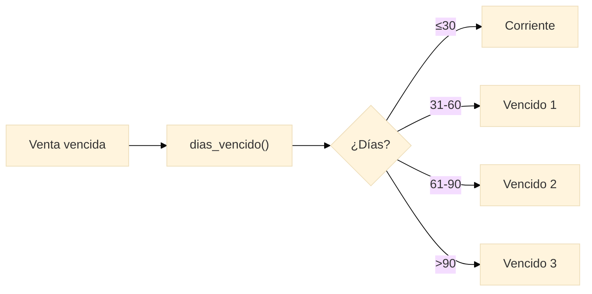

#### Test — Cache invalidation
```python
@override_settings(CACHES={
    'default': {'BACKEND': 'django.core.cache.backends.locmem.LocMemCache'}
})
def test_cache_dashboard_se_invalida_al_registrar_pago(self):
    venta = self._venta_credito(monto='10000.00')
    cache.set('cxc_dashboard_ventas_principal', {'total': 10000}, 300)

    PagoVenta.objects.create(
        venta=venta, monto_pago=Money('5000', 'MXN'),
        cuenta_destino=self.cuenta, metodo_pago='Transferencia',
        fecha_pago=date.today()
    )
    self.assertIsNone(cache.get('cxc_dashboard_ventas_principal'))
```

---

### Iteración 10 — Exportación y Polish (US-13)

**Duración**: 1 semana  
**Puntos**: 5  
**Prácticas XP**: Refactorización final, Small Release

#### Historia
- **US-13**: Exportar a Excel con formato profesional (2 hojas: detalle + resumen)

#### Refactorización — Code smells detectados

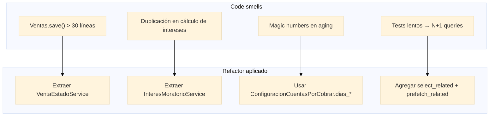

---

## 7. Roadmap Visual (Gantt)

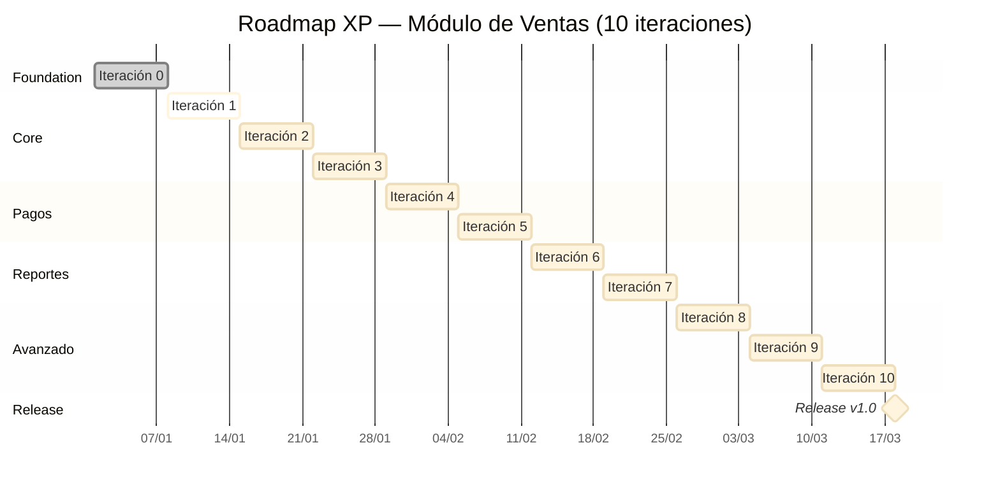

---

## 8. Integración Continua — Pipeline

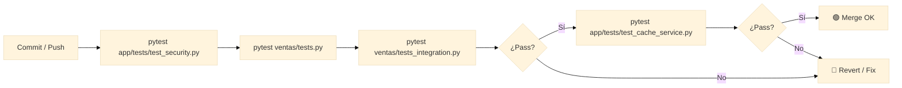

---

## 9. Métricas por Iteración

| Iteración | Velocidad (pts) | Tests nuevos | Cobertura | Deuda técnica abordada |
|-----------|-----------------|--------------|-----------|------------------------|
| 0 | 0 (spike) | 3 | — | Base técnica |
| 1 | 8 | 12 | 85% | — |
| 2 | 5 | 8 | 82% | — |
| 3 | 8 | 10 | 84% | Refactor `save()` |
| 4 | 11 | 18 | 88% | Extraer `derive_estado()` |
| 5 | 8 | 14 | 87% | — |
| 6 | 13 | 22 | 90% | Servicios de reporte |
| 7 | 8 | 10 | 85% | — |
| 8 | 11 | 12 | 86% | — |
| 9 | 13 | 16 | 89% | Cache abstraction |
| 10 | 5 | 6 | 91% | Polish |

**Velocidad promedio**: 9.9 pts/iteración  
**Tests totales**: ~131  
**Cobertura final objetivo**: ≥ 90%

---

## 10. Roles XP

| Rol | Responsabilidad | Quién |
|-----|-----------------|-------|
| **Cliente (Product Owner)** | Define historias, prioriza, acepta demos | Gerente comercial |
| **Programadores** | TDD, implementan, refactorizan | Dev team |
| **Testers** | Tests de aceptación, exploratorio | Dev team (TDD) |
| **Tracker** | Mide velocidad, identifica bloqueos | Dev lead |
| **Coach XP** | Facilita prácticas, enseña TDD/pairing | Dev lead senior |

---

## 11. Checklist de Calidad XP

### Inicio de iteración
- [ ] Planning Game con cliente (30 min)
- [ ] Historias en tarjetas visibles
- [ ] Tests de aceptación acordados

### Durante la iteración
- [ ] Pair programming en lógica crítica (pagos, anticipos)
- [ ] TDD: rojo → verde → refactor (mínimo 1 ciclo/hora)
- [ ] Push frecuente (cada par de horas)
- [ ] CI verde antes de cada merge
- [ ] Refactorización: mínimo 1 al día

### Fin de iteración
- [ ] Demo funcional al cliente (15 min)
- [ ] Retrospectiva: ¿Qué funcionó? ¿Qué mejorar?
- [ ] Actualizar métricas de velocidad
- [ ] Revisar cobertura de tests (`pytest --cov`)

---

*Documento generado aplicando skills: `mermaid-diagrams` + `xp-practices`.*
