# Módulo de Ventas — Arquitectura, Flujos y Mejoras Propuestas

> Documento técnico generado el 4 de abril de 2026.  
> Cubre la arquitectura actual, flujos de negocio, diagrama de modelos y oportunidades de mejora.

---

## Tabla de Contenidos

1. [Visión General](#1-visión-general)
2. [Diagrama de Modelos (ERD)](#2-diagrama-de-modelos-erd)
3. [Flujo 1 — Ciclo de vida de una Venta](#3-flujo-1--ciclo-de-vida-de-una-venta)
4. [Flujo 2 — Gestión de Crédito](#4-flujo-2--gestión-de-crédito)
5. [Flujo 3 — Registro de Pagos y Estado de Cobranza](#5-flujo-3--registro-de-pagos-y-estado-de-cobranza)
6. [Flujo 4 — Anticipos](#6-flujo-4--anticipos)
7. [Flujo 5 — Reporte Global de Cobranza](#7-flujo-5--reporte-global-de-cobranza)
8. [Flujo 6 — Vista de Balances](#8-flujo-6--vista-de-balances)
9. [Arquitectura de Capas](#9-arquitectura-de-capas)
10. [Mejoras Propuestas](#10-mejoras-propuestas)

---

## 1. Visión General

El módulo `ventas` cubre el ciclo completo comercial de una empresa exportadora/importadora:

| Área          | Funcionalidad                                                            |
| ------------- | ------------------------------------------------------------------------ |
| **Clientes**  | Registro con límite de crédito, calificación crediticia, mercado destino |
| **Ventas**    | Nacional / Exportación, Contado / Crédito, Venta / Maquila, multi-moneda |
| **Cobranza**  | Seguimiento de estados (Pendiente → Parcial → Pagado / Vencido)          |
| **Anticipos** | Pagos adelantados aplicados como saldo FVR                               |
| **Reportes**  | Balances filtrados por período + reporte global de cobranza              |
| **Métricas**  | DSO (Days Sales Outstanding), tendencias mensuales                       |

---

## 2. Diagrama de Modelos (ERD)

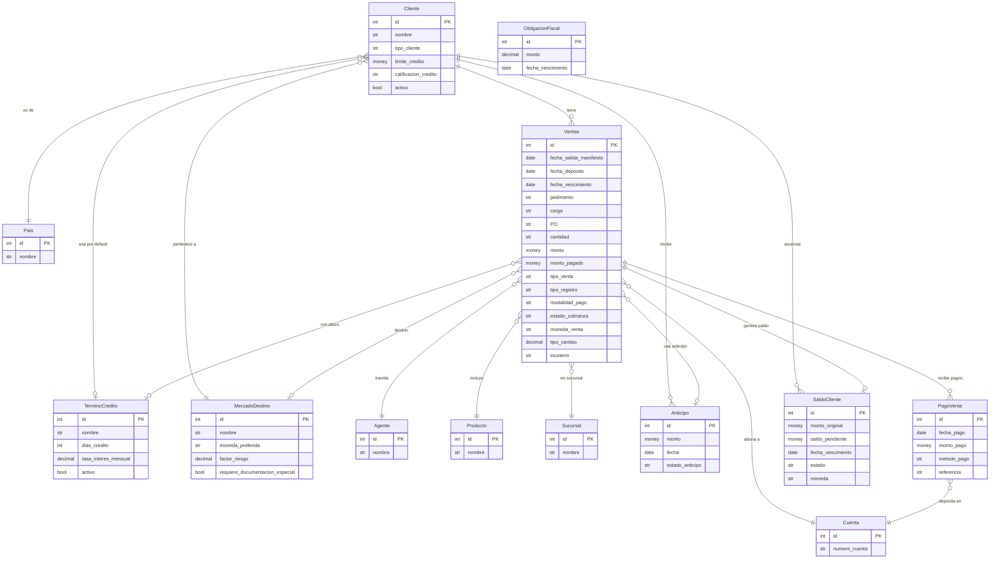

---

## 3. Flujo 1 — Ciclo de vida de una Venta

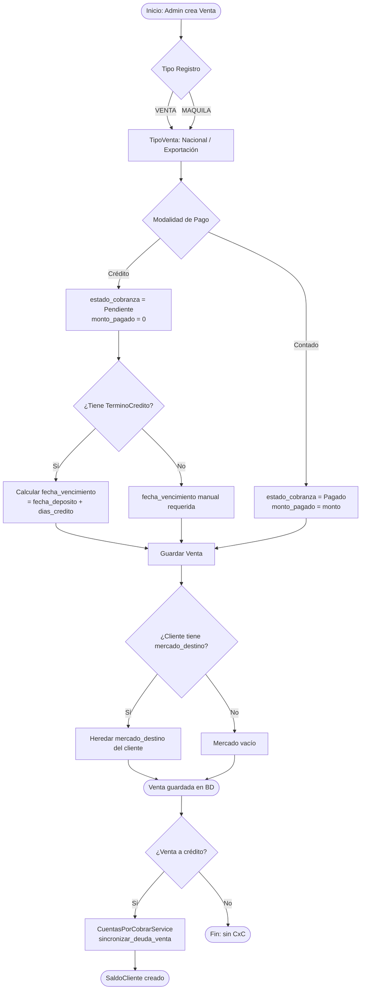

---

## 4. Flujo 2 — Gestión de Crédito del Cliente

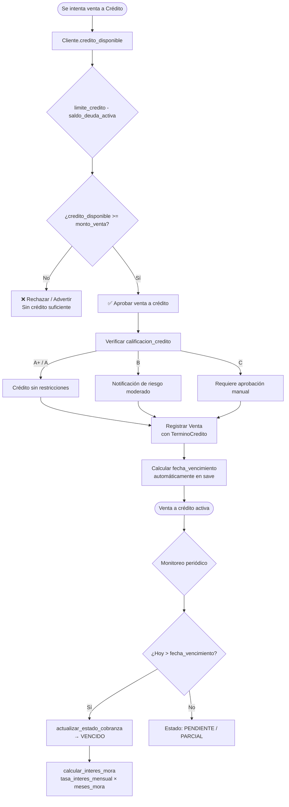

---

## 5. Flujo 3 — Registro de Pagos y Estado de Cobranza

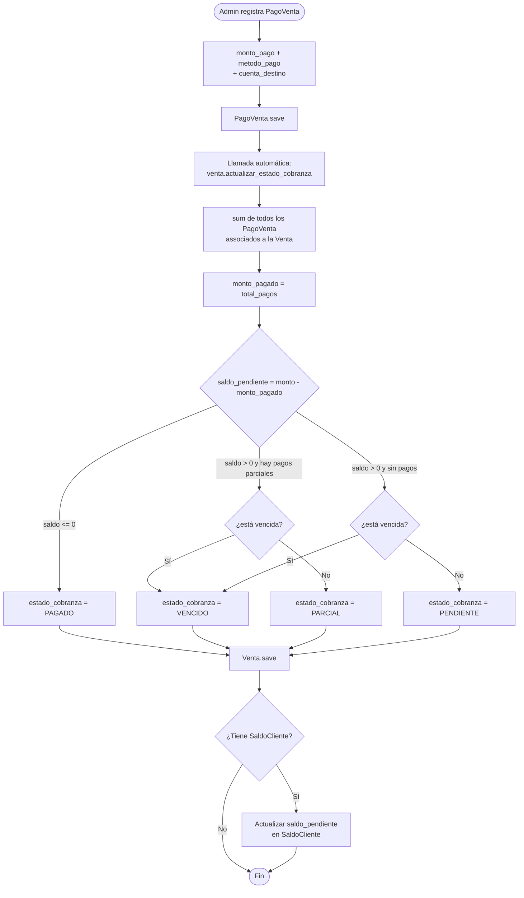

---

## 6. Flujo 4 — Anticipos

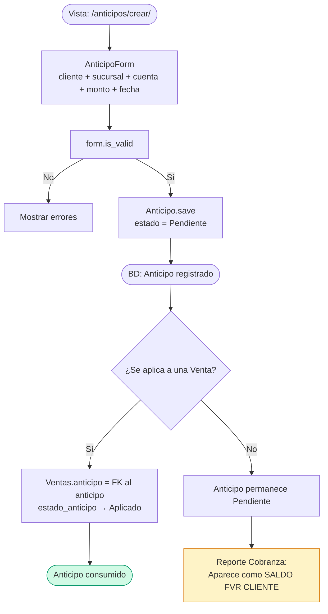

---

## 7. Flujo 5 — Reporte Global de Cobranza

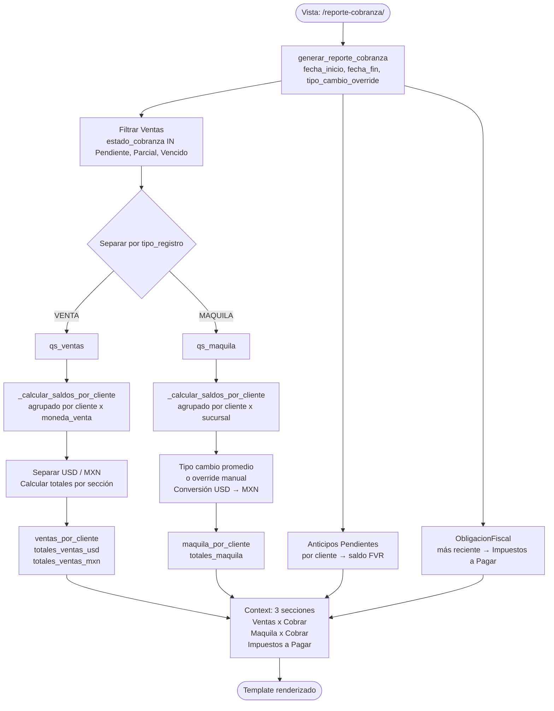

---

## 8. Flujo 6 — Vista de Balances

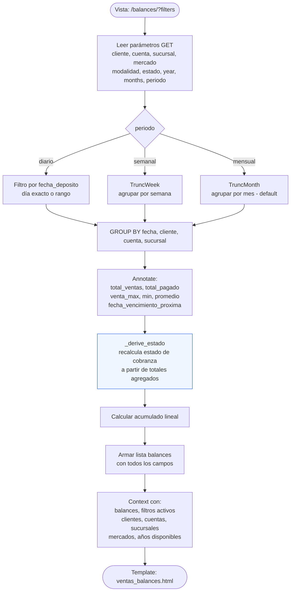

---

## 9. Arquitectura de Capas

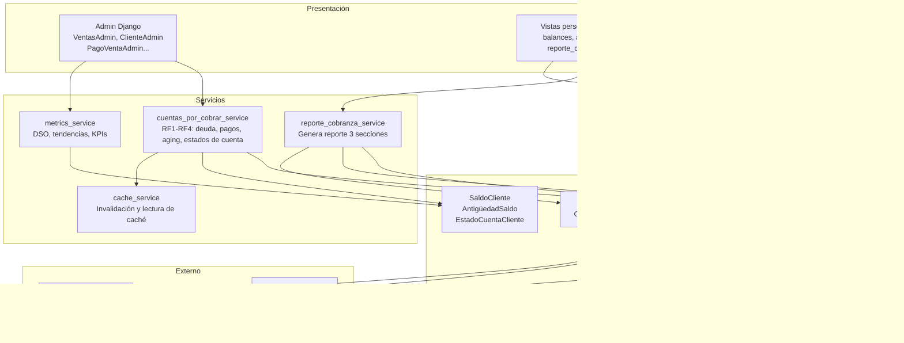

---

## 10. Mejoras Propuestas

### 10.1 Críticas (impacto alto, esfuerzo moderado)

#### A — Automatización del estado VENCIDO

**Problema actual:** El campo `estado_cobranza` solo se actualiza cuando se registra un `PagoVenta`. Si una venta nunca recibe pagos, su estado nunca pasa a `VENCIDO` automáticamente.

**Propuesta:** Comando de gestión (`management/command`) o tarea Celery periódica que ejecute:

```python
Ventas.objects.filter(
    modalidad_pago='Credito',
    estado_cobranza__in=['Pendiente', 'Parcial'],
    fecha_vencimiento__lt=date.today()
).update(estado_cobranza='Vencido')
```

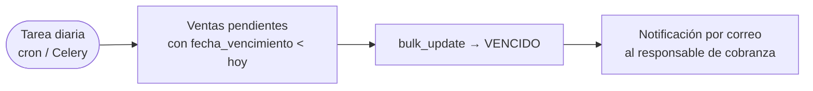

---

#### B — Aplicación manual de Anticipos a Ventas

**Problema actual:** La FK `Ventas.anticipo` existe pero la lógica de cambiar `estado_anticipo → Aplicado` es manual y no hay validación de que el anticipo no se use en dos ventas.

**Propuesta:** Vista/acción de admin `"Aplicar anticipo"` que:

1. Valide que el anticipo esté `Pendiente`.
2. Reste el monto del anticipo del `monto_pagado` de la venta.
3. Cambie `estado_anticipo → Aplicado` en la misma transacción.

---

### 10.2 Importantes (valor de negocio)

#### C — Alertas tempranas de crédito

**Propuesta:** Enviar notificación cuando una cuenta por cobrar alcance el 80% del plazo sin haberse pagado.

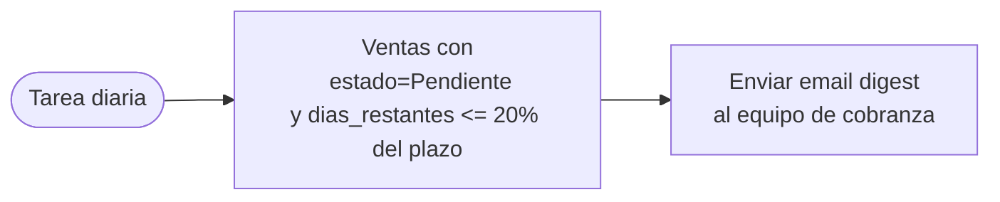

---

#### D — Tipo de cambio centralizado

**Problema actual:** `tipo_cambio` se guarda por venta manualmente. No hay fuente de verdad ni tasa de referencia del día.

**Propuesta:** Campo en `ConfiguracionCuentasPorCobrar` con `tipo_cambio_usd_hoy` actualizable desde el admin, o integración ligera con una API pública (Banxico).

---

#### E — Estado real vs. almacenado (consistencia dual)

**Problema actual:** `build_ventas_balances_context` define una función interna `_derive_estado` que recalcula el estado a partir de los totales, lo que implica que el campo `estado_cobranza` almacenado puede diferir del estado real calculado.

**Propuesta:** Mover `_derive_estado` como método de clase en `Ventas` (ya existe como `actualizar_estado_cobranza`) y ejecutarla de forma consistente. Considerar usar el campo almacenado como única fuente de verdad después de asegurar el punto **A**.

---

### 10.3 Deseables (calidad y experiencia)

#### F — Dashboard de cobranza en tiempo real

**Propuesta:** Añadir una sección al dashboard principal con KPIs clave:

| KPI                          | Cálculo                                                                       |
| ---------------------------- | ----------------------------------------------------------------------------- |
| DSO (Days Sales Outstanding) | `CxC promedio / Ventas crédito × días` — ya implementado en `metrics_service` |
| Tasa de morosidad            | `Ventas vencidas / Total cartera crédito`                                     |
| Cartera por antigüedad       | 0-30d / 31-60d / 61-90d / +90d                                                |
| Recuperación mensual         | Total `PagoVenta` del mes vs. mes anterior                                    |

---

#### G — Historial de cambios de estado en Ventas

**Problema actual:** No hay log de cuándo ni por qué cambió `estado_cobranza`.

**Propuesta:** Aprovechar el módulo `auditoria` ya existente en el proyecto para registrar cada cambio de estado de cobranza con timestamp y usuario.

---

#### H — Exportación desde la vista de Balances

**Problema actual:** La vista `/balances/` no tiene botón de exportación a Excel/CSV.

**Propuesta:** Añadir botones DataTables (ya usados en otras vistas) o una acción GET `?export=xlsx` que use `openpyxl` para generar el reporte con los mismos filtros activos.

---

#### I — Validación de límite de crédito en el Admin

**Problema actual:** `Cliente.puede_otorgar_credito()` y `Cliente.credito_disponible()` existen como métodos pero no se llaman al guardar una `Venta` desde el admin.

**Propuesta:** Sobrescribir `VentasAdmin.save_model` para mostrar un `messages.warning` cuando el crédito disponible sea insuficiente.

```python
def save_model(self, request, obj, form, change):
    if obj.modalidad_pago == 'Credito':
        if not obj.cliente.puede_otorgar_credito(obj.monto.amount):
            messages.warning(request,
                f"⚠️ Crédito insuficiente para {obj.cliente}. "
                f"Disponible: {obj.cliente.credito_disponible()}"
            )
    super().save_model(request, obj, form, change)
```

---

### Resumen de prioridades

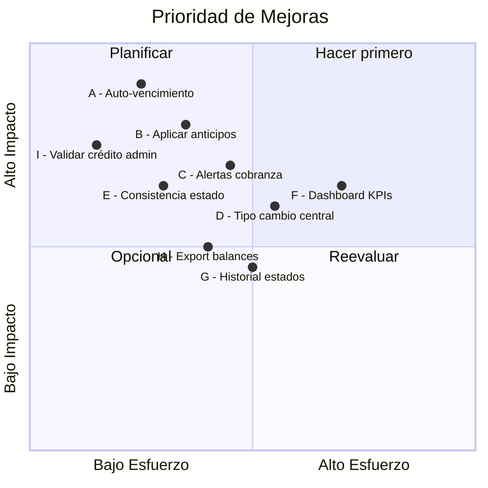
