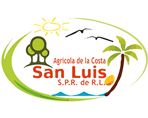

# Proyecto de Gestión Agrícola



Este proyecto es un sistema de gestión para Agricola de la Costa S.P.R. de R.L., desarrollado con Django.

## Tabla de Contenidos

- [Instalación](#instalación)
- [Configuración](#configuración)
- [Uso](#uso)
- [Estructura del Proyecto](#estructura-del-proyecto)
- [Contribuir](#contribuir)
- [Licencia](#licencia)

## Instalación

1. Clona el repositorio:
    ```sh
    git clone https://github.com/tu_usuario/tu_repositorio.git
    cd tu_repositorio
    ```

2. Crea y activa un entorno virtual:
    ```sh
    python -m venv venv
    source venv/bin/activate  # En Windows usa `venv\Scripts\activate`
    ```

3. Instala las dependencias:
    ```sh
    pip install -r requirements.txt
    ```

4. Configura las variables de entorno:
    Copia el archivo `.env_example` a `.env` y modifica las variables según sea necesario.

5. Realiza las migraciones de la base de datos:
    ```sh
    python manage.py migrate
    ```

6. Carga los datos iniciales (si aplica):
    ```sh
    python manage.py loaddata initial_data.json
    ```

## Configuración

Asegúrate de configurar las siguientes variables en tu archivo `.env`:

- `SECRET_KEY`: La clave secreta de Django.
- `DEBUG`: Define si el modo debug está activado (`True` o `False`).
- `ALLOWED_HOSTS`: Lista de hosts permitidos.

## Uso

Para iniciar el servidor de desarrollo, ejecuta:
```sh
python manage.py runserver

Accede a la aplicación en tu navegador en http://localhost:8000.

Estructura del Proyecto

.gitignore
.idea/
app/
catalogo/
gastos/
manage.py
Readme.md
requirements.txt
static/
templates/
venv/

app/: Configuración principal del proyecto Django.
catalogo/: Aplicación para la gestión de catálogos.
gastos/: Aplicación para la gestión de gastos.
static/: Archivos estáticos (CSS, JS, imágenes).
templates/: Plantillas HTML.